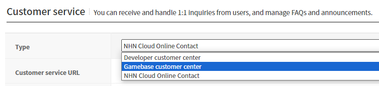

### Contact

Gamebase 는 고객 문의 대응을 위한 기능을 제공합니다.

> [TIP]
>
> NHN Cloud  Contact 서비스와 연동해서 사용하면 보다 쉽고 편리하게 고객 문의에 대응할 수 있습니다.
> 자세한 NHN Cloud  Contact 서비스 이용법은 아래 가이드를 참고하시기 바랍니다.
> [NHN Cloud Online Contact Guide](https://docs.nhncloud.com/ko/Contact%20Center/ko/online-contact-overview/)

#### 권한 설정

* [Game > Gamebase > Android SDK 사용 가이드 > ETC > Contact](../aos-etc.md#contact)
* [Game > Gamebase > iOS SDK 사용 가이드 > ETC > Contact](../ios-etc.md#contact)


#### Customer Service Type

**Gamebase 콘솔 > App > Customer service**에서는 아래와 같이 3가지 유형의 고객 센터를 선택할 수 있습니다.

<!-- LLM_Image_DESC_20260408_191856
    유형: Screenshot
    내용: Customer Service Type 관련 화면
    구성: Customer Service Type 관련 스크린샷
    Keyword: Unreal, Screenshot, Customer Service Type
-->

| Customer Service Type     | Required Login |
| ------------------------- | -------------- |
| Developer customer center | X              |
| Gamebase customer center  | △             |
| NHN Cloud  Online Contact      | O              |

각 유형에 따라 Gamebase SDK 의 고객 센터 API 는 다음 URL 을 사용합니다.

* 개발사 자체 고객 센터(Developer customer center)
    * **고객 센터 URL** 에 입력한 URL.
* Gamebase 제공 고객 센터(Gamebase customer center)
    * 로그인 전 : 유저 정보가 **없는** 고객 센터 URL.
    * 로그인 후 : 유저 정보가 포함된 고객 센터 URL.
* NHN Cloud  조직 상품(Online Contact)
    * 로그인 전 : NOT_LOGGED_IN(2) 에러가 발생.
    * 로그인 후 : 유저 정보가 포함된 고객 센터 URL.

#### Open Contact WebView

고객 센터 웹뷰를 표시합니다.
URL은 고객 센터 유형에 따라 결정됩니다.
ContactConfiguration으로 URL에 추가 정보를 전달할 수 있습니다.

**FGamebaseContactConfiguration**

| Parameter     | Mandatory(M) /<br/>Optional(O) | Values            | Description        |
| ------------- | ------------- | ---------------------------------- | ------------------ |
| UserName      | O             | FString                            | 사용자 이름(닉네임) <br>**default**: ""   |
| AdditionalURL | O             | FString                            | 개발사 자체 고객 센터 URL 뒤에 붙는 추가적인 URL <br>**default**: ""    |
| AdditionalParameters | O      | TMap<string, string>               | 고객 센터 URL 뒤에 붙는 추가적인 파라미터<br>**default**: EmptyMap |
| ExtraData     | O             | TMap<FString, FString>             | 개발사가 원하는 extra data를 고객 센터 오픈 시에 전달<br>**default**: EmptyMap |

**API**

Supported Platforms
<span style="color:#0E8A16; font-size: 10pt">■</span> UNREAL_ANDROID
<span style="color:#1D76DB; font-size: 10pt">■</span> UNREAL_IOS
<span style="color:#F9D0C4; font-size: 10pt">■</span> UNREAL_WINDOWS

```cpp
void OpenContact(const FGamebaseErrorDelegate& onCloseCallback);
void OpenContact(const FGamebaseContactConfiguration& Configuration, const FGamebaseErrorDelegate& onCloseCallback);
```

**ErrorCode**

| Error Code | Description |
| --- | --- |
| NOT\_INITIALIZED(1)                                 | Gamebase.initialize 가 호출되지 않았습니다. |
| NOT\_LOGGED\_IN(2)                                  | 고객 센터 유형이 'NHN Cloud  OC' 인데 로그인 전에 호출하였습니다. |
| UI\_CONTACT\_FAIL\_INVALID\_URL(6911)               | 고객 센터 URL 이 존재하지 않습니다.<br>Gamebase 콘솔의 **고객 센터 URL** 을 확인하세요. |
| UI\_CONTACT\_FAIL\_ISSUE\_SHORT\_TERM\_TICKET(6912) | 사용자 식별을 위한 임시 티켓 발급에 실패하였습니다. |
| UI\_CONTACT\_FAIL\_ANDROID\_DUPLICATED\_VIEW(6913)  | 고객 센터 웹뷰가 이미 표시중입니다. |

**Example**

```cpp
void USample::OpenContact()
{
    UGamebaseSubsystem* Subsystem = UGameInstance::GetSubsystem<UGamebaseSubsystem>(GetGameInstance());
    Subsystem->GetContact()->OpenContact(FGamebaseErrorDelegate::CreateLambda([Subsystem](const FGamebaseError* Error)
    {
        if (Gamebase::IsSuccess(Error))
        {
            UE_LOG(LogTemp, Display, TEXT("OpenContact succeeded."));
        }
        else
        {
            UE_LOG(LogTemp, Display, TEXT("OpenContact failed. (errorCode: %d, errorMessage: %s)"), Error->Code, *Error->Message);

            if (Error->Code == GamebaseErrorCode::WEBVIEW_INVALID_URL)
            {
                // Gamebase Console Service Center URL is invalid.
                // Please check the url field in the TOAST Gamebase Console.
                auto LaunchingInfo = Subsystem->GetLaunching().GetLaunchingInformations();
                UE_LOG(LogTemp, Display, TEXT("csUrl: %s"), *LaunchingInfo->Launching.App.RelatedUrls.CsUrl);
            }
        }
    }));
}
```

#### Request Contact URL

고객 센터 웹뷰를 표시하는 데 사용되는 URL을 반환합니다.

**API**

```cpp
void RequestContactURL(const FGamebaseContactUrlDelegate& Callback);
void RequestContactURL(const FGamebaseContactConfiguration& Configuration, const FGamebaseContactUrlDelegate& Callback);
```

**ErrorCode**

| Error Code | Description |
| --- | --- |
| NOT\_INITIALIZED(1)                                 | Gamebase.initialize 가 호출되지 않았습니다. |
| NOT\_LOGGED\_IN(2)                                  | 고객 센터 유형이 'NHN Cloud  OC' 인데 로그인 전에 호출하였습니다. |
| UI\_CONTACT\_FAIL\_INVALID\_URL(6911)               | 고객 센터 URL 이 존재하지 않습니다.<br>Gamebase 콘솔의 **고객 센터 URL** 을 확인하세요. |
| UI\_CONTACT\_FAIL\_ISSUE\_SHORT\_TERM\_TICKET(6912) | 사용자를 식별을 위한 임시 티켓 발급에 실패하였습니다. |

**Example**

``` cs
void USample::RequestContactURL(const FString& userName)
{
    FGamebaseContactConfiguration Configuration{ userName };

    UGamebaseSubsystem* Subsystem = UGameInstance::GetSubsystem<UGamebaseSubsystem>(GetGameInstance());
    Subsystem->GetContact()->RequestContactURL(Configuration, FGamebaseContactUrlDelegate::CreateLambda([](FString url, const FGamebaseError* Error)
    {
        if (Gamebase::IsSuccess(Error))
        {
            // Open webview with 'contactUrl'
            UE_LOG(LogTemp, Display, TEXT("RequestContactURL succeeded. (url = %s)"), *url);
        }
        else
        {
            UE_LOG(LogTemp, Display, TEXT("RequestContactURL failed. (errorCode: %d, errorMessage: %s)"), Error->Code, *Error->Message);

            if (Error->Code == GamebaseErrorCode::UI_CONTACT_FAIL_INVALID_URL)
            {
                // Gamebase Console Service Center URL is invalid.
                // Please check the url field in the TOAST Gamebase Console.
            }
            else
            {
                // An Error occur when requesting the contact web view url.
            }
        }
    }));
}
```
