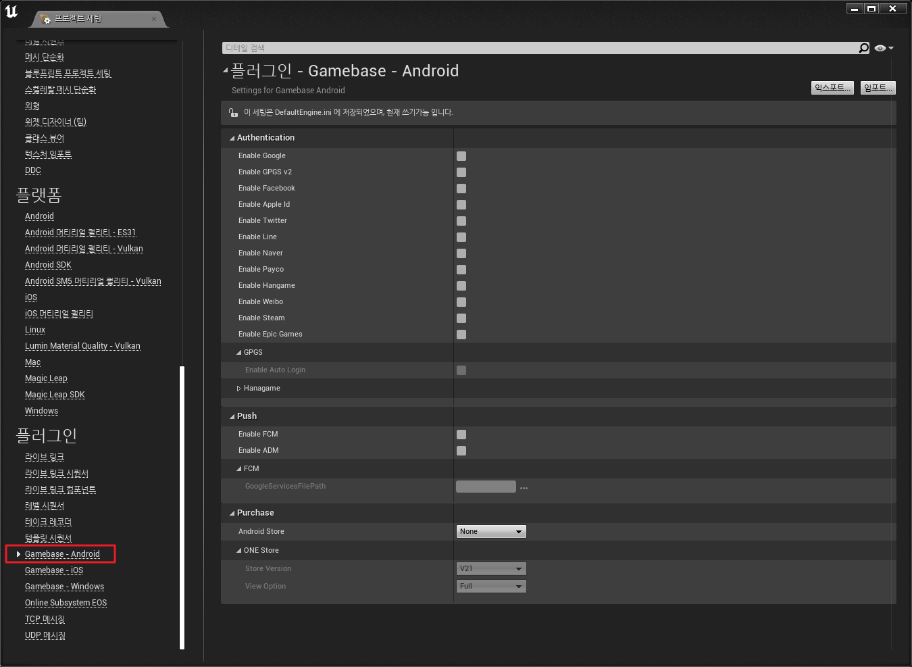
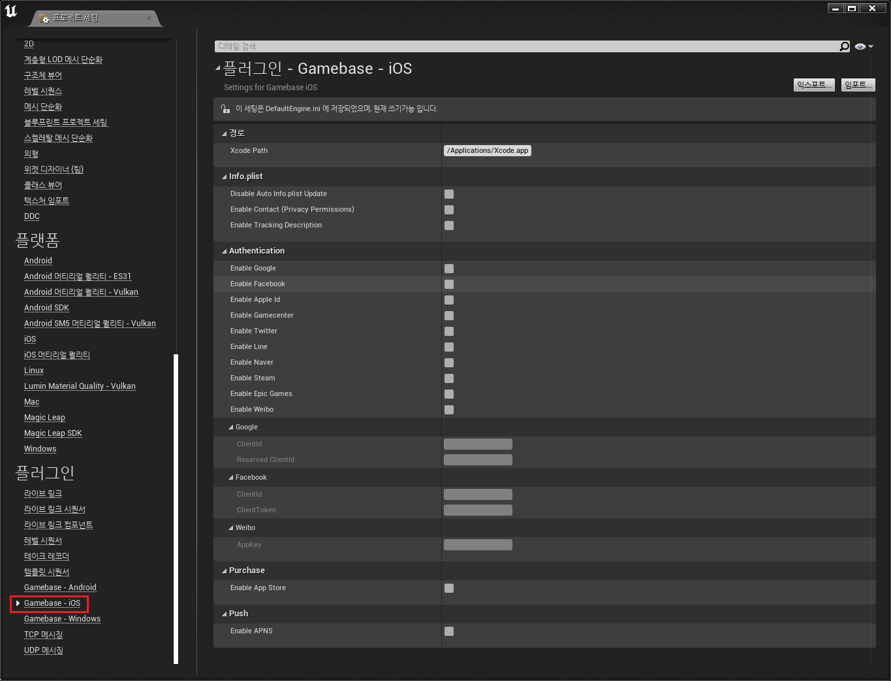
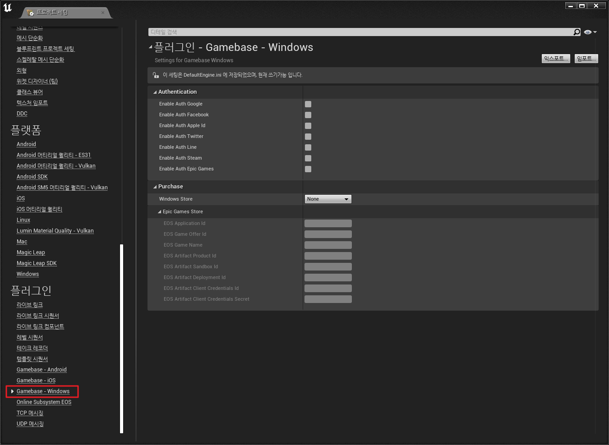

## Installation

1. Gamebase Unreal SDK를 다운로드한 뒤 프로젝트 경로에 **Plugins** 폴더를 만들고, 다운로드한 SDK 내부 **NHNCloud** 폴더를 추가합니다.
    * [Download Gamebase Unreal SDK](/Download/#game-gamebase)
2. Unreal 에디터에서 **Settings > Plugins** 창을 띄우고, **Project > NHN Cloud > Gamebase Plugin** 플러그인을 찾아 활성화합니다.

### Module Settings

* Gamebase 코드를 사용하려면 모듈의 Build.cs 파일에서 의존 모듈 설정 시 아래와 같이 모듈을 추가해야 합니다.

        PrivateDependencyModuleNames.AddRange(
            new[]
            {
                "Gamebase"
            }
        );

### Android Settings

1. 에디터의 메뉴 **Edit > Project Settings**를 선택합니다.
2. Project Settings 창의 Plugin 카테고리에서 **Gamebase - Android**를 선택합니다.


<!-- LLM_Image_DESC_20260406
    유형: Screenshot
    내용: Unreal Engine의 Gamebase Android 플러그인 설정 화면
    구성: Unreal Editor의 플러그인 설정 창에서 Gamebase - Android 탭이 선택된 상태. Authentication(IdP 활성화), Purchase, Push 등의 설정 항목이 표시되며, 각 항목의 체크박스와 입력 필드가 어두운 에디터 배경에 나열됨
    Keyword: Unreal, Android, 프로젝트설정, Gamebase, 플러그인
-->

* Authentication
    * 사용하려는 IdP를 활성화합니다.
    * Hangame IdP 사용 시 고객 센터로 별도로 문의 바랍니다.
    * GPGS(Google Play Games Services)
        * Auto Login - GPGS 자동 로그인을 지원 
* Push
    * 사용하려는 푸시 서비스를 활성화합니다.
    * FCM
        * 해당 기능을 사용하는 경우 활성화됩니다.
        * GoogleServicesFilePath - [Firebase Notification Settings](../../aos-started.md#firebase-notification) 시 다운로드한 google-services.json 파일의 경로를 지정합니다.
* Purchase
    * 사용하려는 스토어를 선택합니다.
    * ONE Store
        * 해당 스토어를 사용하는 경우 활성화됩니다.
        * View Option - 전체 결제 화면(Full)과 팝업 결제 화면(Popup) 중 선택합니다.

#### Google Play 인증 및 결제가 되지 않는 문제

Google Play 서비스에 인증과 결제를 진행하려면 Distribution 설정이 필요합니다.
상세한 내용은 아래 문서를 참고하시기 바랍니다. 

* [Signing Projects for Release](https://docs.unrealengine.com/en-US/Platforms/Mobile/Android/DistributionSigning/index.html)

#### GPGS(Google Play Games Services) 설정

Sign in with Apple 사용 시 프로젝트에서 /Config/Android/AndroidEngine.ini 파일에 아래 내용을 추가하여 GPGS의 Application ID를 입력합니다.

```ini
[/Script/AndroidRuntimeSettings.AndroidRuntimeSettings]
GamesAppID=
```

#### AndroidX 적용

* Gamebase Android SDK 2.25.0 부터 AndroidX가 도입되어 [UPL(Unreal Plugin Language)](https://docs.unrealengine.com/4.27/en-US/SharingAndReleasing/Mobile/UnrealPluginLanguage/) 파일에 아래 설정을 추가해야 합니다.

```xml
<gradleProperties>    
  <insert>
    android.useAndroidX=true      
    android.enableJetifier=true    
  </insert>  
</gradleProperties>
```

#### multidex 적용

* Gamebase Unreal SDK 2.26.0 부터 Gamebase 내부에서 설정하던 multidex 관련 내용이 제거되었으므로, [UPL(Unreal Plugin Language)](https://docs.unrealengine.com/4.27/en-US/SharingAndReleasing/Mobile/UnrealPluginLanguage/) 파일에 아래 설정을 추가해야 합니다.

```xml
<buildGradleAdditions>
  <insert>
  android {
    defaultConfig {
      multiDexEnabled true
    }
  }
  </insert>
</buildGradleAdditions>

<androidManifestUpdates>
    <addAttribute tag="application" name="android:name" value="androidx.multidex.MultiDexApplication"/>
</androidManifestUpdates>
```

#### Epic Games 서비스

* [로그인 인증 타입](https://dev.epicgames.com/docs/api-ref/enums/eos-e-login-credential-type)은 PersistentAuth, AccountPortal을 지원합니다.
    * 이전에 로그인하여 PersistentAuth 로그인을 위한 토큰이 저장되었다면 해당 토큰으로 로그인을 시도합니다. 해당 토큰으로 로그인을 할 수 없는 경우 AccountPortal 로그인을 시도하여 결과를 전달합니다.
* 상세 내용은 아래 내용을 참고하시어 진행 바랍니다.
    * [Game > Gamebase > Unreal SDK 사용 가이드 > 시작하기 > 3rd-Party SDK Provider Settings > Epic Games](./unreal-started-3rd-Party-Provider-SDK-Settings.md#epic-games)

### iOS Settings

Gamebase SDK for Unreal을 사용하려면 `UE4 Github 소스 코드`를 사용해야 하며, Epic games 회원 가입 후 Github 계정을 연결해야 UnrealEngine repository가 노출됩니다.
관련 가이드는 아래 문서를 참고하시기 바랍니다.

* [Downloading Unreal Engine Source Code](https://docs.unrealengine.com/5.0/en-US/downloading-unreal-engine-source-code/)
* [Getting up and running](https://github.com/EpicGames/UnrealEngine#getting-up-and-running)

>`!중요`
> 이 과정을 무시할 경우, 아래 가이드 링크가 정상 작동하지 않거나 Gamebase SDK for Unreal 사용이 불가합니다.

#### Project Settings

1. 에디터의 메뉴 **Edit > Project Settings**를 선택합니다.
2. Project Settings 창의 Plugin 카테고리에서 **Gamebase - iOS**를 선택합니다.


<!-- LLM_Image_DESC_20260406
    유형: Screenshot
    내용: Unreal Engine의 Gamebase iOS 플러그인 설정 화면
    구성: Unreal Editor의 플러그인 설정 창에서 Gamebase - iOS 탭이 선택된 상태. Path(Xcode 경로), Authentication(IdP 활성화), Purchase, Push 등의 설정 항목과 Enable Tracking Descriptor 옵션이 표시됨
    Keyword: Unreal, iOS, 프로젝트설정, Gamebase, 플러그인
-->

* Path
    * Xcode Path: Xcode의 경로를 입력합니다. (기본값: /Applications/Xcode.app)
* Info.plist
    * Disable Auto Info.plist Update: Project Settings에 의한 Info.plist 자동 업데이트를 비활성화합니다.
        * `AdditionalPlistData`로 Info.plist를 직접 관리하는 경우 활성화하세요.
        * IdP별 설정 항목은 [Game > Gamebase > iOS SDK 사용 가이드 > 시작하기 > IdP Settings](../../ios-started.md#idp-settings)를 참고하세요.
    * Enable Contact (Privacy Permissions): 고객센터에서 첨부 파일 사용을 위한 카메라, 사진 라이브러리, 마이크 권한 설명을 Info.plist에 추가합니다.
    * Enable Tracking Description: App Tracking Transparency 권한 요청을 위한 NSUserTrackingUsageDescription을 Info.plist에 추가합니다.
* Authentication
    * 사용하려는 IdP를 활성화합니다.
    * 각 IdP별 추가 설정 항목은 다음과 같습니다.
        * Facebook: `FacebookAppId`, `FacebookClientToken`, `FacebookDisplayName`
        * Google: `GoogleClientId`, `GoogleReservedClientId`
        * Weibo: `WeiboAppKey`
* Purchase
    * 사용하려는 스토어를 선택합니다.
* Push
    * 사용하려는 푸시 서비스를 활성화합니다.

#### Gamebase Unreal SDK 사용을 위한 엔진 수정

Gamebase Unreal SDK 및 외부 인증 SDK에서 swift로 개발된 프레임워크를 컴파일하려면 [Engine/Source/Programs/UnrealBuildTool/Platform/IOS/IOSToolChain.cs](https://github.com/EpicGames/UnrealEngine/blob/4.26/Engine/Source/Programs/UnrealBuildTool/Platform/IOS/IOSToolChain.cs) 파일에서 아래 코드를 추가해야 합니다.

```cpp
// need to tell where to load Framework dylibs
Result += " -rpath /usr/lib/swift";                 // 추가 코드
Result += " -rpath @executable_path/Frameworks";
```

#### Sign in with Apple

Sign in with Apple 사용 시 프로젝트에서 /Config/IOS/IOSEngine.ini 파일에 아래 내용을 추가합니다.

```ini
[/Script/IOSRuntimeSettings.IOSRuntimeSettings]
bEnableSignInWithAppleSupport=True
```

#### Remote Notification

1. Gamebase Remote Notification 기능을 사용하려면 **Project Settings > Platforms > iOS** 설정에서 **Enable Remote Notifications Support** 기능을 활성화해야 합니다. (Github 소스에서만 가능)
2. Foreground 푸시 알림을 받기 위해서는 [Engine/Source/Runtime/ApplicationCore/Private/IOS/IOSAppDelegate.cpp](https://github.com/EpicGames/UnrealEngine/blob/4.26/Engine/Source/Runtime/ApplicationCore/Private/IOS/IOSAppDelegate.cpp) 파일에서 아래 코드를 제거하거나,

        - (void)userNotificationCenter:(UNUserNotificationCenter *)center
            willPresentNotification:(UNNotification *)notification
                withCompletionHandler:(void (^)(UNNotificationPresentationOptions options))completionHandler
        {
            // Received notification while app is in the foreground
            HandleReceivedNotification(notification);
        
            completionHandler(UNNotificationPresentationOptionNone);
        }

    다음과 같이 수정해야 합니다.
    
        // AS-IS
        completionHandler(UNNotificationPresentationOptionNone);
        
        // TO-BE
        completionHandler(UNNotificationPresentationOptionAlert);
    

#### Rich Push Notification

다음과 같은 이슈로 인해 Rich Push Notification 기능을 사용할 수 없습니다.

* Unreal은 프로젝트에 [Notification Service Extension](https://developer.apple.com/documentation/usernotifications/unnotificationserviceextension?language=objc)을 추가할 수 있는 방법을 제공하지 않습니다.
    * [NHN Cloud Push Notification Service Extension 생성](https://docs.toast.com/e  n/TOAST/en/toast-sdk/push-ios/#notification-service-extension)

#### iOS SDK의 Warning 메시지로 인한 Unreal 빌드 오류

iOS SDK에서 발생하는 Warning 메시지가 Unreal 빌드 시 오류로 변환되어 빌드에 실패하는 현상이 발생하면 [Engine/Source/Programs/UnrealBuildTool/Platform/IOS/IOSToolChain.cs](https://github.com/EpicGames/UnrealEngine/blob/4.24/Engine/Source/Programs/UnrealBuildTool/Platform/IOS/IOSToolChain.cs) 파일에서 clang 컴파일 옵션 코드를 주석 처리하십시오.

```cpp
// Result += " -Wall -Werror";
```

#### PLCrashReporter

UE4에서 사용 중인 PLCrashReporter가 `arm64e` architecture를 지원하지 않아, 해당 architecture를 사용하는 디바이스에서 메모리 주솟값을 획득하지 못하는 이슈가 있습니다.

NHN Cloud Log & Crash Search에서 크래시 분석을 사용하는 게임 개발사는 다음 가이드를 참고하여 UE4 내부 PLCrashReporter를 수정해야 합니다.

1. GamebaseSDK-Unreal/Source/Gamebase/ThirdParty/IOS/plcrashreporter.zip 파일을 압축 해제합니다.
2. UE4 내부 PLCrashReporter의 a 파일과 header 파일을 압축 해제한 파일로 교체합니다.
    * Engine/Source/ThirdParty/PLCrashReporter/plcrashreporter-master-xxxxxxx

#### Epic Games 서비스

* [로그인 인증 타입](https://dev.epicgames.com/docs/api-ref/enums/eos-e-login-credential-type)은 PersistentAuth, AccountPortal을 지원합니다.
    * 이전에 로그인하여 PersistentAuth 로그인을 위한 토큰이 저장되었다면 해당 토큰으로 로그인을 시도합니다. 해당 토큰으로 로그인을 할 수 없는 경우 AccountPortal 로그인을 시도하여 결과를 전달합니다.
* 상세 내용은 아래 내용을 참고하시어 진행 바랍니다.
    * [Game > Gamebase > Unreal SDK 사용 가이드 > 시작하기 > 3rd-Party SDK Provider Settings > Epic Games](./unreal-started-3rd-Party-Provider-SDK-Settings.md#epic-games)

### Windows Settings

1. 에디터의 메뉴 **Edit > Project Settings**를 선택합니다.
2. Project Settings 창의 Plugin 카테고리에서 **Gamebase - Windows**를 선택합니다.


<!-- LLM_Image_DESC_20260406
    유형: Screenshot
    내용: Unreal Engine의 Gamebase Windows 플러그인 설정 화면
    구성: Unreal Editor의 플러그인 설정 창에서 Gamebase - Windows 탭이 선택된 상태. Authentication(IdP 활성화), Purchase, Push 등의 설정 항목이 표시됨
    Keyword: Unreal, Windows, 프로젝트설정, Gamebase, 플러그인
-->

* Authentication
    * 사용하려는 IdP를 활성화합니다.
* Purchase
    * 사용하려는 스토어를 선택합니다.
    * Epic Games Store
        * EOS 서비스 정보를 각 항목에 맞게 입력합니다.

#### WebView 플러그인 안내

* WebView 사용 콘텐츠를 사용 시 플러그인 활성화가 필요합니다.
    * GameNotice
    * ImageNotices
    * WebView
* 별도의 엔진 수정 없이 WebView 관련 기능을 사용할 경우 Unreal 에디터에서 **Settings > Plugins** 창을 띄우고, **Project > NHN Cloud > NHNWebView** 플러그인을 찾아 활성화합니다.
* 엔진에서 제공하는 Web Browser 플러그인을 사용할 경우 엔진 내부에 CEF 버전과 Web Browser 기능에 따라 기능이 정상적으로 동작하지 않을 수 있습니다.

> <font color="red">[주의]</font><br/>
>
> NHNWebView 플러그인과 Web Browser 플러그인은 동시의 사용이 불가능하며, 두 플러그인이 모두 활성화되어 있는 경우 빌드 시 오류가 발생합니다.

#### Epic Games 서비스

* [로그인 인증 타입](https://dev.epicgames.com/docs/api-ref/enums/eos-e-login-credential-type)은 ExchangeCode, AccountPortal을 지원합니다.
    * 런처에서 게임을 실행하여 ExchangeCode를 사용할 수 있다면 해당 코드로 로그인을 시도합니다. 해당 코드로 로그인을 할 수 없는 경우 AccountPortal 로그인을 시도하여 결과를 전달합니다.
* 상세 내용은 아래 내용을 참고하시어 진행 바랍니다.
    * [Game > Gamebase > Unreal SDK 사용 가이드 > 시작하기 > 3rd-Party SDK Provider Settings > Epic Games](./unreal-started-3rd-Party-Provider-SDK-Settings.md#epic-games)

#### Steamworks 서비스

* Windows에서 Steam 인증 및 결제는 Steamworks SDK를 통해 진행됩니다.
* Gamebase에서 지원하는 Steamworks의 버전은 1.59 입니다. UE 5.3 이하를 사용하는 경우 Steamworks를 업데이트해야 합니다.
    * 엔진 가이드를 확인하여 엔진의 Steamworks 모듈을 해당 버전으로 업데이트하세요.
        * [참고: 엔진 내 Steamworks 업그레이드 가이드](https://dev.epicgames.com/documentation/en-us/unreal-engine/online-subsystem-steam?application_version=4.27)
    * Online Subsystem Steam을 사용하는 경우 최신 버전의 Online Subsystem과 Online Subsystem Steam의 최신 버전 적용 코드를 참조하여 업데이트해야 합니다.
        * [참고: Online Subsystem Steam 엔진 최신 버전 커밋](https://github.com/EpicGames/UnrealEngine/commit/f6fd8dcf34a0cc31412dd473c1309c8e507981f3#diff-cd0b8c3bbdff4546195efef417923e90acead93b3625d8d82afe82fe0939b8a6)
* 내부에서는 Engine.ini의 OnlineSubsystemSteam의 bEnabled이 활성화된 경우 Online Subsystem Steam을 사용하는 것으로 간주합니다. 그 외의 경우 Gamebase에서 사용하는 Steamworks 지원 버전을 충족하면 자동으로 Steamworks 모듈을 사용합니다.

        [OnlineSubsystemSteam]
		bEnabled=True

> <font color="red">[주의]</font><br/>
>
> Online Subsystem Steam 없이 Steamworks만 사용 시 Gamebase 내부에서 Steamworks를 사용한 인증 정보를 받아 오는 작업만 진행하며 Steamworks SDK 프로세스를 진행하지 않습니다.
> Steamworks SDK를 직접 적용 시 초기화, 업데이트, 종료 등 필수적인 처리에 대해서는 직접 구현해야 합니다.
