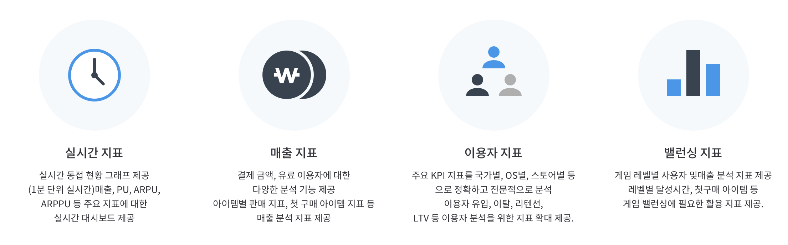

## Key Features

### Gamebase Analytics

Gamebase SDK만 적용하면, 매출, 이용자, 게임밸런싱 지표를 무료로 제공합니다. 
게임에서 발생하는 매출, 동접, 이용자, 레벨, 아이템 판매 등 게임 사업과 운영에  꼭 필요한 지표 서비스를 제공합니다. 
빠르게 적용하시고 서비스에 적극 활용해보세요!

#### Reference

* [콘솔 사용 가이드 > Analytics](../../oper-analytics.md) 

### Authentication

Gamebase는 여러 IdP(identity provider)의 계정을 이용한 ID, 비밀번호 기반의 OAuth 로그인과 단말기의 UUID를 이용한 게스트 로그인을 지원합니다. Gamebase의 인증은 자체적인 회원 체계를 구축하지 않고 외부 IdP에서 제공하는 회원 정보를 이용하여 인증 서비스를 제공하는 서비스입니다. 자체적인 회원 체계가 없다라는 것은 사용자의 아이디, 비밀번호를 Gamebase 내부에 저장하지 않는 것을 의미합니다.

* **다양한 인증 방식을 단일 인터페이스로 제공합니다.** 
  단일 인터페이스로 API를 제공하여 보다 쉽고 빠르게 외부 IdP 추가 개발이 가능하기 때문에 개발 비용이 절감됩니다. 개발자는 복잡한 인증 절차나 법적 문제, 정책 문제 등을 고려하지 않고 쉽게 인증 기능을 구현할 수 있습니다.

* **다양한 외부 IdP 인증을 제공합니다.** 
  제공하는 외부 인증은 지속적으로 업데이트될 예정이며 게임에서 사용하길 원하는 인증이 있는 경우에는 [고객 센터](https://toast.com/support/inquiry)로 연락주시기 바랍니다.

다음은 Gamebase에서 지원하는 외부 인증 목록입니다.

| 외부 인증             | Android | iOS | Unity(Windows, macOS, WebGL) | Unreal(Windows) |
| ----------------- | ------------ | ------------ | ------------ | ------------ |
| Facebook          | O | O | O | O |
| Sign In with Apple | O  | O | O | O |
| Apple Game Center |  | O | | |
| Google            | O | O | O | O |
| PAYCO             | O | O | O | |
| NAVER             | O | O | O | |
| Twitter			| O | O | O | O |
| LINE				| O | O | O | O |
| Hangame			| O | O | O  | |
| Weibo | O  | O  | | |
| Steam | O  | O  | | O |
| Epic Games | O  | O  | | O |

* **게스트 로그인을 제공합니다.**
  게스트 로그인을 이용하면 사용자는 아무런 입력 없이 바로 게임에 로그인하여 간편하게 게임을 시작할 수 있습니다. 게스트 로그인만으로도 Gamebase 사용자 아이디가 발급되므로 게임은 OAuth 로그인 사용자와 게스트 로그인 사용자의 구분 없이 동일하게 사용자의 게임 데이터를 관리할 수 있습니다.
  
* **독립적인 회원 식별자를 제공합니다.**
  최초로 로그인하면 Gamebase 사용자 아이디가 자동으로 생성되며, 게임에서는 사용자를 구별하는 식별자로 사용하실 수 있습니다. 사용자 아이디는 인증 방식과 관계 없이 모든 사용자에게 발급되며 IdP에 종속적이지 않으므로 어떤한 IdP를 통해 로그인하더라도 게임 내에서 동일한 방식으로 사용자 처리가 가능합니다.
  
* **로그아웃 및 게임 탈퇴 기능을 제공합니다.**
  로그아웃 이후 다른 인증 방식을 선택하여 다시 로그인할 수 있으며, 게임 탈퇴를 진행하면 사용자의 사용자 아이디 및 관련된 모든 정보를 Gamebase에서 삭제합니다.
  
* **게임 이용자 한 명이 여러 개의 외부 IdP를 동시에 사용할 수 있도록 매핑(mapping) 기능을 제공합니다.**
  예를 들어 Facebook 인증을 사용하여 게임을 이용하고 있는 사용자가 Google 인증으로도 동일한 사용자 아이디를 사용할 수 있도록 매핑 기능을 제공합니다. 하나의 사용자 아이디에 Facebook과 Google 인증을 매핑하면 게임 이용자는 어떤 기기에서는 Facebook, 또 다른 기기에서는 Google로 인증하여 게임을 할 수 있습니다.

#### Reference

* [Android SDK 사용 가이드 > 인증](../../aos-authentication.md)
* [iOS SDK 사용 가이드 > 인증](../../ios-authentication.md)
* [Unity SDK 사용 가이드 > 인증](../../unity-authentication.md)
* [Unreal SDK 사용 가이드 > 인증](../../unreal-authentication.md)

### Payment

게임사는 이미 만들어진 게임을 여러 개의 스토어에 출시하면 적은 노력으로 수익을 극대화할 수 있습니다. Gamebase를 사용하면 손쉽게 여러 개의 스토어와 연동할 수 있어 주요 스토어별 결제 연동 스펙을 완벽하게 학습하지 않아도 됩니다.

다음은 Gamebase에서 지원하는 스토어 목록입니다.
* Google Play
* App Store
* Galaxy Store
* ONE Store
* Steam
* Epic Games Store
* Amazon Appstore
* MyCard

* **여러 스토어의 인앱 결제를 단일 인터페이스로 제공합니다.**
  단일 인터페이스로 API를 제공해 보다 쉽고 빠르게 스토어를 추가 개발할 수 있어 개발 비용이 절감됩니다. 개발자는 복잡한 결제 연동 방법을 학습하지 않고 쉽게 결제 기능을 구현할 수 있습니다.  
* **별도로 운용하는 결제 검증 서버로 결제 보안 및 안정성을 확보할 수 있습니다.**
  Gamebase에서 외부 스토어와의 결제 검증을 위한 별도 서버를 구축하여 모바일 특성상 불안정할 수 있는 결제 트랜잭션 처리를 보다 안정적으로 제공하고 있습니다. 불안정한 네트워크 상태를 고려해 결제 재시도 및 아이템 지급 처리 관리를 별도로 하고 있습니다.
* **단일 아이템 구매 뿐만 아니라 구독, 프로모션 기능을 제공합니다.**  
  Google Play와 App Store의 구독 기능을 제공해 월 상품을 사용자에게 판매할 수 있습니다. 게임에서는 별도 구현 없이 손쉽게 Google의 프로모션 기능도 사용할 수 있습니다. 외부 스토어에서 추가되는 기능들은 앞으로도 계속 Gamebase에도 추가 기능으로 제공할 예정입니다.
* **웹 콘솔에서의 다양한 기능(결제 내역 조회 기능 등)으로 고객 문의에 원활하게 대응할 수 있습니다.**
  웹 콘솔에서 사용자의 결제 내역과 아이템 지급 상태를 확인할 수 있고 결제 취소 및 어뷰징 대응도 가능합니다.

#### Reference

* [Android SDK 사용 가이드 > 결제](../../aos-purchase.md)
* [iOS SDK 사용 가이드 > 결제](../../ios-purchase.md)
* [Unity SDK 사용 가이드 > 결제](../../unity-purchase.md)
* [Unreal SDK 사용 가이드 > 결제](../../unreal-purchase.md)

### Launching

서비스되고 있는 게임 앱은 처음 시작할 때 여러 정보가 필요합니다. Gamebase는 게임 앱 실행 초기에 운영에 필요한 데이터를 게임 앱에 제공하며, 이를 Launching이라고 부릅니다.
론칭 정보는 Gamebase Console에서 실시간으로 설정할 수 있으며, SDK 초기화나 론칭 상태 변경 시에 게임에서 확인할 수 있습니다.

Gamebase에서 제공되는 론칭 정보는 다음과 같습니다.

* 앱 상태 정보
	* 게임 클라이언트 업데이트 필요 여부, 다운로드 URL
	* 점검 정보
* 긴급 공지 정보
* 인증 정보
* 게임 인앱 URL 목록

#### Reference

* [Android SDK 사용 가이드 > 초기화 > Launching Status](../../aos-initialization.md#launching-status)
* [iOS SDK 사용 가이드 > 초기화 > Launching Status](../../ios-initialization.md#launching-status)
* [Unity SDK 사용 가이드 > 초기화 > Launching Information](../../unity-initialization.md#launching-information)
* [Unreal SDK 사용 가이드 > 초기화 > Launching Information](../../unreal-initialization.md#launching-information)
* [콘솔 사용 가이드 > 앱](../../oper-app.md): 앱, 클라이언트 상태 및 설치 URL 설정
* [콘솔 사용 가이드 > 운영](../../oper-operation.md): 점검, 공지 등록

### For Global

Gamebase는 기본적으로 게임의 글로벌 오픈을 지원하고 있으며 글로벌 환경에서의 게임 운영을 지원하기 위하여 다음과 같은 기능들을 제공합니다.

* **게임 이용자에게 표시되는 메시지는 모두 다국어 처리가 가능합니다.**
	* 게임 이용자에게 표시되는 메시지를 Console에서 입력할 때 다국어로 입력받아 이용자의 기기 언어 설정에 맞게 언어를 표시합니다. Console에서 한국어, 영어, 일본어를 입력하면 한국어 기기를 사용하는 이용자에게는 한국어 메시지가 표시됩니다.
* **국가 필터링 기능을 제공합니다.**
	* 운영 중에 특정 국가의 게임 이용자에게만 긴급 공지 메시지나 푸시 메시지를 보내고 싶은 경우, 국가를 지정하여 메시지를 표시할 수 있습니다. 
* **운영자의 현지 표준 시간대(local timezone)를 선택하여 손쉽게 시간 입력이 가능합니다.**
	* 베트남에서 게임을 운영하는 경우, 베트남 표준 시간대(timezone)를 선택하여 베트남 시간 기준으로 입력할 수 있으므로, 한국 시간으로 변경하는 수고를 줄일 수 있습니다.

### Using the other NHN Cloud Service

* 게임에서 필요한 NHN Cloud 서비스를 보다 쉽게 연동할 수 있도록 돕습니다. 
  * **Gamebase 사용자 아이디**로 각 서비스의 API를 사용할 수 있도록 Gamebase에서 래핑(wrapping)하여 API를 제공합니다. 따라서, 사용자는 별도 서비스의 API를 직접 호출할 필요가 없습니다. **Gamebase 유저 ID**로 푸시를 보내거나 랭킹 순위 등록이 가능합니다.
  * [Notification > Push](https://toast.com/service/notification/push) : 푸시 메시지를 발송해 주는 통합 푸시 서비스  
  * [Game > Leaderboard](https://toast.com/service/game/leaderboard) : 실시간 대용량 랭킹 서비스
  * [Security > AppGuard](https://toast.com/service/security/appguard) : 실시간으로 애플리케이션의 코드 조작을 방지하는 서비스
