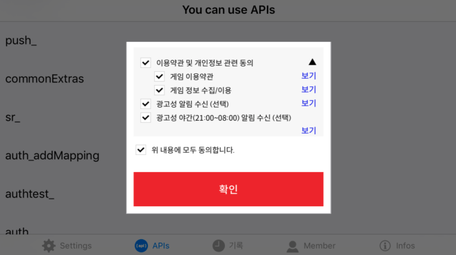

## Terms

Gamebase 콘솔에 설정한 약관을 표시합니다.



showTermsView API 는 웹뷰로 약관 창을 표시해줍니다.
Game 의 UI 에 맞는 약관 창을 직접 제작하고자 하는 경우에는 queryTerms API를 호출하여, Gamebase 콘솔에 설정한 약관 항목을 불러올 수 있습니다.
유저가 약관에 동의했다면 각 항목별 동의 여부를 updateTerms API를 통해 Gamebase 서버로 전송하시기 바랍니다.

### showTermsView

약관 창을 화면에 띄워 줍니다.
유저가 약관에 동의를 했을 경우, 동의 여부를 서버에 등록합니다.
약관에 동의했다면 showTermsView API를 다시 호출해도 약관 창이 표시되지 않고 바로 성공 콜백이 반환됩니다.
단, Gamebase 콘솔에서 '약관 재동의' 항목을 **필요** 로 변경했다면 유저가 다시 약관에 동의할 때까지는 약관 창이 표시됩니다.

#### Required 파라미터

* Activity : 약관 창이 노출되는 Activity입니다.
 
#### Optional 파라미터

* GamebaseTermsConfiguration : GamebaseTermsConfiguration 객체를 통해 강제 약관 동의창 표시여부와 같은 설정을 변경할 수 있습니다.
* GamebaseDataCallback : 약관 동의 후 약관 창이 종료될 때 사용자에게 콜백으로 알려줍니다. 콜백으로 오는 GamebaseDataContainer 객체는 GamebaseShowTermsViewResult로 변환해서 추가 정보를 확인할 수 있습니다.

**API**

```java
+ (void)Gamebase.Terms.showTermsView(@NonNull Activity activity,
                                     @Nullable GamebaseDataCallback<GamebaseDataContainer> callback);
+ (void)Gamebase.Terms.showTermsView(@NonNull Activity activity,
                                     @Nullable GamebaseTermsConfiguration configuration,
                                     @Nullable GamebaseDataCallback<GamebaseDataContainer> callback);
```

**GamebaseTermsConfiguration**

| API | Mandatory(M) / Optional(O) | Description |
| --- | --- | --- |
| newBuilder() | **M** | GamebaseTermsConfiguration.Builder 객체는 newBuilder() 함수를 통해 생성할 수 있습니다. |
| build() | **M** | 설정을 마친 Builder 를 Configuration 객체로 변환합니다. |
| setForceShow(boolean forceShow) | O | 약관에 동의했다면 showTermsView API를 다시 호출해도 약관 창이 표시되지 않지만, 이를 무시하고 강제로 약관 창을 표시합니다.<br>**default**: false |
| enableFixedFontSize(boolean enable) | O | 시스템 글자 크기를 무시하고 고정된 크기로 약관을 표시합니다.<br>**default**: false |

**GamebaseShowTermsViewResult**

| Field | Type | Nullable / NonNull | Description |
| --- | --- | --- | --- |
| isTermsUIOpened | boolean | NonNull | **true** : 유저가 약관에 동의하여 약관 창이 종료되었습니다.<br>**false** : 이미 약관에 동의하여 약관 창이 표시되지 않고 종료되었습니다. |
| pushConfiguration | PushConfiguration | Nullable | isTermsUIOpened가 **true**이고, 약관에 푸시 수신 동의 여부를 추가했다면 pushConfiguration은 항상 유효한 객체를 가집니다.<br>그렇지 않을 경우에는 **null**입니다.<br>pushConfiguration이 유효할 때 pushConfiguration.pushEnabled 값은 항상 **true**입니다. |

**ErrorCode**

| Error | Error Code | Description |
| --- | --- | --- |
| NOT\_INITIALIZED | 1 | Gamebase가 초기화되어 있지 않습니다. |
| LAUNCHING\_SERVER\_ERROR | 2001 | 론칭 서버에서 전달받은 항목에 약관 관련 내용이 없는 경우에 발생하는 에러입니다.<br/>정상적인 상황이 아니므로 Gamebase 담당자에게 문의해주시기 바랍니다. |
| UI\_TERMS\_ALREADY\_IN\_PROGRESS\_ERROR | 6924 | Terms API 호출이 아직 완료되지 않았습니다.<br/>잠시 후 다시 시도하세요. |
| UI\_TERMS\_ANDROID\_DUPLICATED\_VIEW | 6925 | 약관 웹뷰가 아직 종료되지 않았는데 다시 호출되었습니다. |
| WEBVIEW\_TIMEOUT | 7002 | 약관 웹뷰 표시 중 타임아웃이 발생했습니다. |
| WEBVIEW\_HTTP\_ERROR | 7003 | 약관 웹뷰 오픈 중 HTTP 오류가 발생했습니다. |

**Example**

```java
static PushConfiguration savedPushConfiguration = null;
final GamebaseTermsConfiguration configuration = GamebaseTermsConfiguration.newBuilder()
        .setForceShow(true)
        .build();
Gamebase.Terms.showTermsView(activity, configuration, (container, exception) -> {
    if (Gamebase.isSuccess(exception)) {
        // Save the PushConfiguration and use it for Gamebase.Push.registerPush()
        // after Gamebase.login().
        GamebaseShowTermsViewResult termsViewResult = GamebaseShowTermsViewResult.from(container);
        if (termsViewResult != null) {
            savedPushConfiguration = termsViewResult.pushConfiguration;
        }
    } else {
        new Thread(() -> {
            // Wait for a while and try again.
            try { Thread.sleep(2000); }
            catch (Exception ignored) {}
            showTermsView(activity, callback);
        }).start();
    }
});
public void afterLogin(Activity activity) {
    // Call registerPush with saved PushConfiguration.
    if (savedPushConfiguration != null) {
        Gamebase.Push.registerPush(activity, savedPushConfiguration, exception -> {...});
    }
}
```

### queryTerms

Gamebase는 단순한 형태의 웹뷰로 약관을 표시합니다.
게임UI에 맞는 약관을 직접 제작하고자 하신다면, queryTerms API를 호출하여 Gamebase 콘솔에 설정한 약관 정보를 내려받아 활용하실 수 있습니다.

'선택' 약관 항목은 로그인 후에 호출하면 동의 여부도 함께 알 수 있습니다. 단, '필수' 항목의 동의 여부는 항상 false로 반환됩니다.

> <font color="red">[주의]</font><br/>
>
> * GamebaseTermsContentDetail.getRequired()가 true인 필수 항목은 동의 여부를 Gamebase 서버에 저장하지 않으므로 agreed 값은 항상 false로 반환됩니다.
>     * 약관 필수 항목에 동의하지 않은 경우 게임 진행 또는 게임 로그인이 불가능하므로 약관 팝업이 닫혀 있고 로그인되어 있는 상태라면 자연스럽게 약관 필수 항목에 동의한 것과 같습니다. 그래서 로그인한 유저는 이미 필수 항목에 모두 동의한 상태이므로 굳이 동의 여부를 저장할 필요가 없습니다.
> * 푸시 수신 동의 여부도 Gamebase 서버에 저장되지 않으므로 agreed 값은 항상 false로 반환됩니다.
>     * 푸시 수신 동의 여부는 Gamebase.Push.queryTokenInfo API를 통해 조회하시기 바랍니다.
> * 콘솔에서 '기본 약관 설정'을 하지 않는 경우 약관 언어와 다른 국가 코드로 설정된 단말기에서 queryTerms API를 호출하면 `UI_TERMS_NOT_EXIST_FOR_DEVICE_COUNTRY(6922)` 오류가 발생합니다.
>     * 콘솔에서 '기본 약관 설정'을 하거나, `UI_TERMS_NOT_EXIST_FOR_DEVICE_COUNTRY(6922)` 오류가 발생했을 때는 약관을 표시하지 않도록 처리하시기 바랍니다.

#### Required 파라미터

* Activity : API 호출 시점의 최상위 Activity입니다.
* GamebaseDataCallback : API 호출 결과를 사용자에게 콜백으로 알려줍니다. 콜백으로 오는 GamebaseQueryTermsResult 로 콘솔에 설정된 약관 정보를 얻을 수 있습니다.

**API**

```java
+ (void)Gamebase.Terms.queryTerms(@NonNull Activity activity,
                                  @NonNull GamebaseDataCallback<GamebaseQueryTermsResult> callback);
```

**ErrorCode**

| Error | Error Code | Description |
| --- | --- | --- |
| NOT\_INITIALIZED | 1 | Gamebase가 초기화되어 있지 않습니다. |
| UI\_TERMS\_NOT\_EXIST\_IN\_CONSOLE | 6921 | 약관 정보가 콘솔에 등록되어 있지 않습니다. |
| UI\_TERMS\_NOT\_EXIST\_FOR\_DEVICE\_COUNTRY | 6922 | 단말기 국가코드에 맞는 약관 정보가 콘솔에 등록되어 있지 않습니다. |

**Example**

```java
Gamebase.Terms.queryTerms(activity, new GamebaseDataCallback<GamebaseQueryTermsResult>() {
    @Override
    public void onCallback(GamebaseQueryTermsResult result, GamebaseException exception) {
        if (Gamebase.isSuccess(exception)) {
            // Succeeded.
            final int termsSeq = result.getTermsSeq();
            final String termsVersion = result.getTermsVersion();
            final String termsCountryType = result.getTermsCountryType();
            final List<GamebaseTermsContentDetail> contents = result.getContents();
        } else if (exception.getCode() == GamebaseError.UI_TERMS_NOT_EXIST_FOR_DEVICE_COUNTRY) {
            // Another country device.
            // Pass the 'terms and conditions' step.
        } else {
            // Failed.
        }
    }
});
```

#### GamebaseQueryTermsResult

| API            | Values                          | Description         |
| -------------------- | --------------------------------| ------------------- |
| getTermsSeq             | int                             | 약관 전체 KEY.<br/>updateTerms API 호출 시 필요한 값입니다.          |
| getTermsVersion         | String                          | 약관 버전.<br/>updateTerms API 호출 시 필요한 값입니다.              |
| getTermsCountryType     | String                          | 약관 타입.<br/> - KOREAN : 한국 약관 <br/> - GDPR : 유럽 약관 <br/> - ETC : 기타 국가 |
| getContents             | List<GamebaseTermsContentDetail> | 약관 항목별 상세 정보 |

#### GamebaseTermsContentDetail

| API            | Values                | Description         |
| -------------------- | ----------------------| ------------------- |
| getTermsContentSeq      | int                   | 약관 항목 KEY         | 
| getName                 | String                | 약관 항목 이름         |
| getRequired             | boolean                  | 필수 동의 여부         |
| getAgreePush            | String                | 광고성 푸시 동의 여부<br/> - NONE: 동의 안 함 <br/> - ALL: 전체 동의 <br/> - DAY: 주간 푸시 동의<br/> - NIGHT: 야간 푸시 동의          |
| getAgreed               | boolean                  | 해당 약관 항목에 대한 유저 동의 여부.<br/> - 로그인 전에는 항상 false.<br/> - 푸시 항목은 항상 false. |
| getNode1DepthPosition   | int                   | 1단계 항목 노출 순서           |
| getNode2DepthPosition   | int                   | 2단계 항목 노출 순서<br/> 없을 경우 -1           |
| getDetailPageUrl        | String                | 약관 자세히 보기 URL<br/> 없을 경우 null. |

### updateTerms

queryTerms API 로 내려받은 약관 정보로 UI 를 직접 제작했다면,
게임유저가 약관에 동의한 내역을 updateTerms API를 통해 Gamebase 서버로 전송하시기 바랍니다.

선택 약관 동의를 취소하는 것과 같이, 약관에 동의했던 내역을 변경하는 목적으로도 활용하실 수 있습니다.

> <font color="red">[주의]</font><br/>
>
> 푸시 수신 동의 여부는 Gamebase 서버에 저장되지 않습니다.
> 푸시 수신 동의 여부는 **로그인 후에** Gamebase.Push.registerPush API를 호출해서 저장하세요.

#### Required 파라미터

* Activity : API 호출 시점의 최상위 Activity입니다.
* GamebaseUpdateTermsConfiguration : 서버에 등록할 유저의 선택 약관 정보입니다.

#### Optional 파라미터

* GamebaseCallback : 선택 약관 정보를 서버에 등록 후 사용자에게 콜백으로 알려줍니다.

**API**

```java
+ (void)Gamebase.Terms.updateTerms(@NonNull Activity activity,
                                   @NonNull GamebaseUpdateTermsConfiguration configuration,
                                   @Nullable GamebaseCallback callback);
```

**ErrorCode**

| Error | Error Code | Description |
| --- | --- | --- |
| NOT\_INITIALIZED | 1 | Gamebase가 초기화되어 있지 않습니다. |
| UI\_TERMS\_UNREGISTERED\_SEQ | 6923 | 등록되지 않은 약관 Seq 값을 설정하였습니다. |
| UI\_TERMS\_ALREADY\_IN\_PROGRESS\_ERROR | 6924 | Terms API 호출이 아직 완료되지 않았습니다.<br/>잠시 후 다시 시도하세요. |

**Example**

```java
Gamebase.Terms.queryTerms(activity, new GamebaseDataCallback<GamebaseQueryTermsResult>() {
    @Override
    public void onCallback(GamebaseQueryTermsResult result, GamebaseException queryTermsException) {
        if (Gamebase.isSuccess(queryTermsException)) {
            // Succeeded to query terms.
            final int termsSeq = result.getTermsSeq();
            final String termsVersion = result.getTermsVersion();
            final List<GamebaseTermsContent> contents = new ArrayList<>();
            for (GamebaseTermsContentDetail detail : result.getContents()) {
                GamebaseTermsContent content = GamebaseTermsContent.from(detail);
                // TODO: Change agree value what you want.
                content.setAgreed(agreeOrNot);
                contents.add(content);
            }

            final GamebaseUpdateTermsConfiguration configuration =
                    GamebaseUpdateTermsConfiguration.newBuilder(termsSeq, termsVersion, contents)
                            .build();
            Gamebase.Terms.updateTerms(activity, configuration, new GamebaseCallback() {
                @Override
                public void onCallback(GamebaseException updateTermsException) {
                    if (Gamebase.isSuccess(updateTermsException)) {
                        // Succeeded to update terms.
                    } else {
                        // Failed to update terms.
                    }
                }
            });
        } else {
            // Failed to query terms.
        }
    }
});
```

#### GamebaseUpdateTermsConfiguration

**Builder**

| API                  | Description         |
| -------------------- | ------------------- |
| newBuilder(String termsVersion, int termsSeq, List<GamebaseTermsContent> contents) | Configuration 객체 생성을 위한 Builder 를 생성합니다. |
| build() | 설정을 마친 Builder 를 Configuration 객체로 변환합니다. |

| Parameter            | Mandatory(M) / Optional(O) | Type                    | Description         |
| -------------------- | -------------------------- | ------------------------- | ------------------- |
| termsSeq             | **M**                      | int                       | 약관 전체 KEY.<br/>queryTerms API를 호출해 내려받은 값을 전달해야 합니다.             |
| termsVersion         | **M**                      | String                    | 약관 버전.<br/>queryTerms API를 호출해 내려받은 값을 전달해야 합니다.   |
| contents             | **M**                      | List<GamebaseTermsContent> | 선택 약관 유저 동의 정보  |

#### GamebaseTermsContent

**Constructor**

| API                  | Description         |
| -------------------- | ------------------- |
| GamebaseTermsContent(int termsContentSeq, boolean agreed) | GamebaseTermsContent 생성자입니다. |
| from(GamebaseTermsContentDetail) | GamebaseTermsContentDetail 객체로부터 GamebaseTermsContent 객체를 생성하는 팩토리 메서드입니다. |
| setAgreed(boolean) | 해당 객체의 agreed 값을 변경합니다. |

| Parameter            | Mandatory(M) / Optional(O) | Values             | Description         |
| -------------------- | -------------------------- | ------------------ | ------------------- |
| termsContentSeq      | **M**                      | int                | 선택 약관 항목 KEY      |
| agreed               | **M**                      | boolean            | 선택 약관 항목 동의 여부  |

### isShowingTermsView

현재 약관 창이 표시되어 있는 상태인지를 알려 줍니다.

**API**

```java
+ (boolean)Gamebase.Terms.isShowingTermsView();
```
