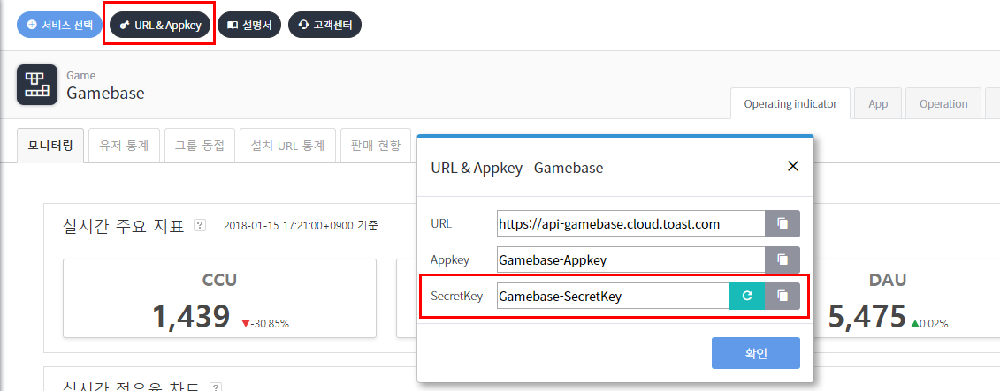

## Game > Gamebase > API v1.2 가이드

## 변경 사항
- IAP(in app purchase) API가 변경되었습니다.
- Get Simple Launching API 호출 시 필수 파라미터로 storeCode가 추가되었습니다.
- Check Maintenance API 응답 결과에 점검 대상에 대한 storeCode 정보가 추가되었습니다.
- GUEST 계정의 단말기 이전에 사용되는 TransferAccount에 대해, 사전에 발급된 TransferAccount를 검증할 수 있는 Validate TransferAccount API가 추가되었습니다.
- API 응답 결과의 date 타입이 Epoch time에서 ISO 8601 형식(yyyy-MM-dd'T'HH:mm:ssXXX)으로 변경되었습니다. Token Authentication, Get Member, Get Members API 응답 결과의 regDate, lastLoginDate 항목
- 쿠폰 소진 API가 추가되었습니다.
- 사용자 탈퇴 API가 추가 되었습니다.
- Purchase(IAP)의 구매 가격(price) 데이터 타입이 가이드상에서 Long 으로 잘못 표기된 것을 Float 타입으로 변경하였습니다.
- 탈퇴 유예 기능 추가에 따라 Token Authentication, Get Member API 응답 결과에 탈퇴 유예 상태인 사용자에 대한 정보가 추가 되었습니다.

## Advance Notice

Gamebase Server API는 RESTful 형식으로, 서버 API를 사용하기 위해서는 다음 정보들을 알고 있어야 합니다.

#### Server Address

API를 호출하기 위한 서버 주소는 다음과 같습니다. 해당 주소는 Gamebase Console 화면에서도 확인 가능합니다.
> https://api-gamebase.cloud.toast.com


#### AppId

앱 ID는 NHN Cloud 프로젝트 ID로 앱 메뉴 화면에서 확인할 수 있습니다.


#### SecretKey

비밀 키(secret key)는 API에 대한 접근 제어 방안으로, Gamebase Console에서 확인할 수 있습니다. 비밀 키는 Server API를 호출할 때 HTTP 헤더에 필수로 설정해야 합니다.
> [참고]
> 비밀 키가 외부에 노출되어 잘못된 호출이 발생한다면 **생성** 버튼을 클릭하여 새로운 비밀 키를 만든 후, 새 비밀 키를 사용하면 됩니다.



#### TransactionId

API를 호출하는 서버에서 내부적으로 API 요청을 관리할 수 있는 방안으로 TransactionId 기능을 제공합니다. 호출하는 서버에서 HTTP 헤더에 트랜잭션 ID를 설정하여 API를 호출하면, Gamebase 서버는 응답 HTTP Header 및 응답 결과의 Response Body Header에 해당 TransactionId를 설정하여 결과를 전달합니다.

## Common

#### HTTP Header

API 호출 시 HTTP Header에 다음 항목들을 설정해야 합니다.

| Name | Required | Value |
| --- | --- | --- |
| Content-Type | mandatory | application/json; charset=UTF-8 |
| X-Secret-Key | mandatory |SecretKey 설명 참고 |
| X-TCGB-Transaction-Id | optional | TransactionId 설명 참고 |

#### API Response

모든 API 요청에 대한 응답으로 **HTTP 200 OK**를 전달합니다. API 요청 성공 유무는 Response Body의 Header 항목을 참고하여 판단할 수 있습니다.

**[Request]**

```
Content-Type: application/json
X-TCGB-Transaction-Id: 88a1ae42-6b1d-48c8-894e-54e97aca07fq
X-Secret-Key: IgsaAP
GET https://api-gamebase.cloud.toast.com
```

**[Response]**

```
HTTP/1.1 200 OK
Content-Type: application/json;charset=UTF-8
X-TCGB-Transaction-Id: 88a1ae42-6b1d-48c8-894e-54e97aca07fq
```

```json
{
    "header" : {
    	"transactionId": "88a1ae42-6b1d-48c8-894e-54e97aca07fq",
        "isSuccessful" : true,
        "resultCode": 0,
        "resultMessage" : "Success."
    }
}
```

| Key | Type | Description |
| --- | --- | --- |
| transactionId | String | API 요청 시 HTTP Header에 설정한 값.<br>해당 값을 전달하지 않으면 Gamebase 내부적으로 생성된 값을 반환 |
| isSuccessful | boolean | 성공 여부 |
| resultCode | int | 응답 코드<br>성공 시 0, 실패 시 오류 코드 반환 |
| resultMessage | String | 응답 메시지 |

<br>
<br>

## Authentication

#### Token Authentication

로그인 사용자에게 발급된 Gamebase Access Token이 유효한지를 검증합니다. Access Token이 정상이면 해당 사용자의 정보를 리턴합니다.

**[Method, URI]**

| Method | URI |
| --- | --- |
| GET | /tcgb-gateway/v1.2/apps/{appId}/members/{userId}/tokens/{accessToken}?linkedIdP=false |

**[Request Header]**

공통 사항 확인

**[Path Variable]**

| Name | Type | Value |
| --- | --- | --- |
| appId | String | NHN Cloud 프로젝트 ID |
| userId | String | 로그인한 사용자 아이디 |
| accessToken | String | 로그인한 사용자에게 발급된 Access Token |

**[Request Parameter]**

| Name | Type | Required |  Value |
| --- | --- | --- | --- |
| linkedIdP | boolean | optional | true or false (기본값은 false) Access Token을 발급받을 때 사용된, IdP 관련 정보 포함 여부 |

**[Response Body]**

```json
{
    "header": {
        "transactionId": "String",
        "resultCode": 0,
        "resultMessage": "String",
        "isSuccessful": true
    },
    "linkedIdP": {
        "idPCode": "String",
        "idPId": "String"
    },
    "member": {
        "userId": "String",
        "valid": "Y",
        "appId": "String",
        "regDate": "2019-08-27T17:41:05+09:00",
        "lastLoginDate": "2019-08-27T17:41:05+09:00",
        "authList": [
            {
                "userId": "String",
                "authSystem": "String",
                "idPCode": "String",
                "authKey": "String",
                "regDate": "2019-08-27T17:41:05+09:00"
            },
            {
                "userId": "String",
                "authSystem": "String",
                "idPCode": "String",
                "authKey": "String",
                "regDate": "2019-08-27T17:41:05+09:00"
            }
        ],
        "temporaryWithdrawal": {
            "gracePeriodDate": "2020-04-18T09:12:01+09:00"
        }
    }
}
```

| Key | Type | Description |
| --- | --- | --- |
| linkedIdP | Object | 로그인한 사용자가 사용한 IdP 정보 |
| linkedIdP.idPCode | String | IdP 정보 <br>guest, payco, facebook 등 |
| linkedIdP.idPId | String | IdP ID |
| member.userId | String | 사용자 ID |
| member.lastLoginDate | String | 마지막으로 로그인한 시간 ISO 8601 <br>처음 로그인한 사용자는 해당 값이 없음 |
| member.appId | String | appId |
| member.valid | String | 로그인에 성공한 사용자의 값은 "Y" <br>(다른 값에 대한 설명은 멤버 API 참고) |
| member.regDate | String | 사용자가 계정을 생성한 시간 |
| authList | Array[Object] | 사용자 인증 IdP 관련 정보 |
| authList[].authSystem | String | Gamebase 내부적으로 사용되는 인증 시스템 <br>추후 사용자 인증 시스템 지원 예정 |
| authList[].idPCode | String | 사용자 인증 IdP 정보 <br>guest, payco, facebook 등 |
| authList[].authKey | String | authSystem에서 IdP Id 별로 발급된 사용자 구분 값 |
| temporaryWithdrawal | Object | 탈퇴 유예 관련 정보 <br>valid 가 "T" 값에서만 제공 |
| temporaryWithdrawal.gracePeriodDate | String | 탈퇴 유예 만료 시간 ISO 8601 |


**[Error Code]**

[오류 코드](../../error-code.md#server)

<br>
<br>

## Launching

#### Get Simple Launching

Console 화면에서 설정한 서버 주소, 설치 URL 등의 클라이언트 설정 정보 및 현재 점검 상태/시간/ 메시지 등 클라이언트 앱 기동시 제공되는 Launching 정보들에 대해 서버에서 간략히 확인할수 있습니다.
현재 점검 설정 여부만을 확인하고 싶다면, [Check Maintenance] API를 사용하면 됩니다.

**[Method, URI]**

| Method | URI |
| --- | --- |
| GET | /tcgb-launching/v1.2/apps/{appId}/launching/simple |

**[Request Header]**

공통 사항 확인

**[Path Variable]**

| Name | Type | Value |
| --- | --- | --- |
| appId | String | NHN Cloud 프로젝트 ID |

**[Request Parameter]**

| Name | Type | Required | Value |
| --- | --- | --- | --- |
| osCode | Enum | true | OS 코드 <br>- AOS, IOS, WEB, WINDOWS |
| storeCode | Enum | true | 스토어 코드 <br>- GG: Google<br>- ONESTORE<br>- AS: AppStore |
| clientVersion | String | true | 콘솔에서 설정한 클라이언트 버전 |

**[Response Body]**

##### 정상
```json
{
    "header": {
        "resultCode": 0,
        "resultMessage": "String",
        "isSuccessful": true
    },
    "launchingData": {
        "status": {
            "code": 200,
            "message": "String"
        },
        "app": {
            "storeCode": "String",
            "accessInfo": {
                "serverAddress": "String",
                "csInfo": "String"
            },
            "relatedUrls": {
                "termsUrl": "String",
                "csUrl": "String",
                "punishRuleUrl": "String",
                "personalInfoCollectionUrl": "String"
            },
            "install": {
                "url": "String"
            }
        }
    }
}
```

##### 점검
```json
{
    "header": {
        "resultCode": 0,
        "resultMessage": "String",
        "isSuccessful": true
    },
    "launchingData": {
        "status": {
            "code": 303,
            "message": "String"
        },
        "app": {
            "storeCode": "String",
            "accessInfo": {
                "serverAddress": "String",
                "csInfo": "String"
            },
            "relatedUrls": {
                "termsUrl": "String",
                "csUrl": "String",
                "punishRuleUrl": "String",
                "personalInfoCollectionUrl": "String"
            },
            "install": {
                "url": "String"
            }
        },
        "maintenance": {
            "typeCode": "String",
            "beginDate": "2018-05-23T10:44:00+09:00",
            "endDate": "2022-01-01T10:44:00+09:00",
            "url": null,
            "reason": "String",
            "message": "String"
        }
    }
}
```

| Key | Type | Description |
| --- | --- | --- |
| status | Object | 현재 클라이언트 상태를 나타내는 정보 |
| status.code | int | 클라이언트 상태코드 <br><br>정상: 200 <br>업데이트 권장: 201, 업데이트 필수: 300 <br>서비스 종료: 302 <br>점검 중: 303 |
| status.message | String | 클라이언트 상태 메시지 |
| app | Object | 앱의 정보 |
| app.storeCode | String | 앱 스토어코드 <br>"GG", "AS" 등 |
| app.accessInfo | Object | 콘솔 앱 화면에서 설정한 정보 |
| app.accessInfo.serverAddress | String | 서버 주소<br>클라이언트에서 설정한 서버 주소의 우선순위가 높음. <br>클라이언트 서버 주소 미설정시, 앱 화면에서 설정한 서버 주소가 전달됨. |
| app.accessInfo.csInfo | String | 고객 센터 정보 |
| app.relatedUrls | Object | 앱 내에서 사용할 인앱 URL |
| app.relatedUrls.termsUrl | String | 이용약관 |
| app.relatedUrls.csUrl| String | 고객센터 |
| app.relatedUrls.punishRuleUrl | String | 이용 정지 규정 |
| app.relatedUrls.personalInfoCollectionUrl | String | 개인 정보동의 |
| app.install | Object | 앱 설치 정보 |
| app.install.url | String | 설치 URL |
| maintenance | Object | 점검 정보 |
| maintenance.typeCode | String | 점검 타입 코드 <br>APP: 게임에서 설정한 점검 <br>SYSTEM: Gamebase 시스템에서 설정한 점검 |
| maintenance.beginDate | Date | 점검 시작 시간 ISO 8601 |
| maintenance.endDate | Date | 점검 종료 시간 ISO 8601 |
| maintenance.url | String | 점검 URL |
| maintenance.reason | String | 점검 사유 |
| maintenance.message | String | default 점검 사유 메시지 |

<br>
<br>
