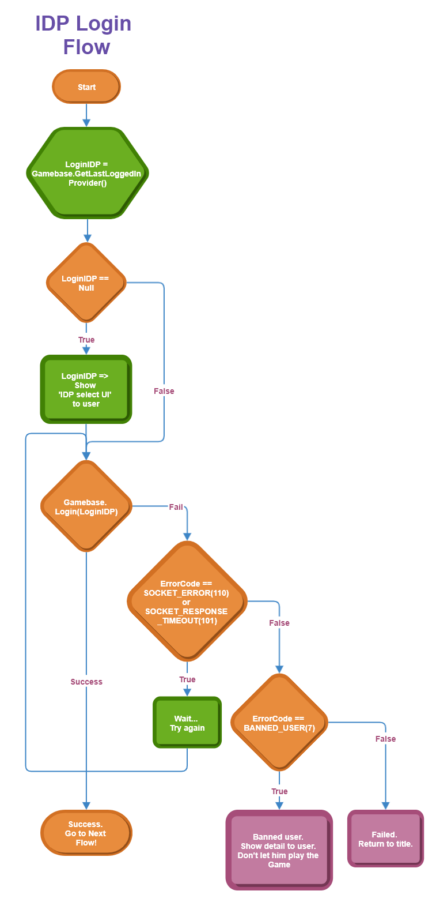

## Game > Gamebase > iOS SDK 사용 가이드 > 인증


## Login

Gamebase에서는 게스트 로그인을 기본으로 지원합니다.

- 게스트 이외의 Provider에 로그인하려면 해당 Provider AuthAdapter가 필요합니다.
- AuthAdapter 및 3rd-Party Provider SDK에 대한 설정은 다음을 참고하시기 바랍니다.
    - [Game > Gamebase > iOS SDK 사용 가이드 > 시작하기 > 3rd-Party Provider SDK Guide](ios-started#3rd-party-provider-sdk-guide)

로그인을 시도하려는 IdP별로, additionalInfo 파라미터를 입력해야 하는 경우가 있습니다.<br/>
AdditionalInfo에 대한 설명은 하단의 **Gamebase에서 지원 중인 IdP** 설명을 참고하시기 바랍니다.


### Import Header File

로그인을 구현하고자 하는 ViewController에 다음의 헤더 파일을 가져옵니다.

```objectivec
#import <Gamebase/Gamebase.h>
```

### Login Flow

많은 게임이 타이틀 화면에서 로그인을 구현합니다.

* 앱을 설치하고 처음 실행했을 때 타이틀 화면에서 게임 유저가 어떤 IdP(identity provider)로 인증할지 선택할 수 있게 합니다.
* 한 번 로그인한 후에는 IdP 선택 화면을 표시하지 않고 이전에 로그인한 IdP 유형으로 인증합니다.

위에서 설명한 로직은 다음과 같은 순서로 구현할 수 있습니다.




#### 1. 이전 로그인 유형으로 인증

* 이전에 인증했던 기록이 있다면 ID와 비밀번호를 입력받지 않고 인증을 시도합니다.
* **[TCGBGamebase loginForLastLoggedInProviderWithViewController:completion:]**을 호출합니다.

#### 1-1. 인증이 성공한 경우

* 축하합니다! 인증에 성공했습니다.
* **[TCGBGamebase userID]**로 사용자 ID를 획득하여 게임 로직을 구현하시면 됩니다.

#### 1-2. 인증이 실패한 경우

* 네트워크 오류
    * 오류 코드가 **TCGB_ERROR_SOCKET_ERROR(110)** 또는 **TCGB_ERROR_SOCKET_RESPONSE_TIMEOUT(101)**인 경우, 일시적인 네트워크 문제로 인증이 실패한 것이므로 **[TCGBGamebase loginForLastLoggedInProviderWithViewController:completion:]**을 다시 호출하거나, 잠시 후 다시 시도합니다.
* 이용 정지 게임 유저
    * 오류 코드가 **TCGB_ERROR_BANNED_MEMBER(7)**인 경우, 이용 정지 게임 유저이므로 인증에 실패한 것입니다.
    * **[TCGBBanInfo banInfoFromError:error]**로 제재 정보를 확인하여 게임 유저에게 게임을 플레이할 수 없는 이유를 알려 주시기 바랍니다.
    * Gamebase 초기화 시 **[TCGBConfiguration enablePopup:YES]** 및 **[TCGBConfiguration enableBanPopup:YES]**를 호출한다면 Gamebase가 이용 정지에 관한 팝업 창을 자동으로 띄웁니다.
* 그 외 오류
    * 이전 로그인 유형으로 인증하기가 실패하였습니다. **'2. 지정된 IdP로 인증'**을 진행합니다.

#### 2. 지정된 IdP로 인증

* IdP 유형을 직접 지정하여 인증을 시도합니다.
    * 인증 가능한 유형은 **TCGBConstants.h** 파일의 **TCGBAuthIdPs**에 선언돼 있습니다.
* **[TCGBGamebase loginWithType:viewController:completion:]** API를 호출합니다.

#### 2-1. 인증에 성공한 경우

* 축하합니다! 인증에 성공했습니다.
* **[TCGBGamebase userID]**로 사용자 ID를 획득하여 게임 로직을 구현하시면 됩니다.

#### 2-2. 인증에 실패한 경우

* 네트워크 오류
    * 오류 코드가 **TCGB_ERROR_SOCKET_ERROR(110)** 또는 **TCGB_ERROR_SOCKET_RESPONSE_TIMEOUT(101)**인 경우, 일시적인 네트워크 문제로 인증에 실패한 것이므로 **[TCGBGamebase loginWithType:viewController:completion:]**을 다시 호출하거나, 잠시 후 다시 시도합니다.
* 이용 정지 게임 사용자
    * 오류 코드가 **TCGB_ERROR_BANNED_MEMBER(7)**인 경우, 이용 정지 게임 유저이므로 인증에 실패한 것입니다.
    * **[TCGBBanInfo banInfoFromError:error]** 로 제재 정보를 확인하여 게임 유저에게 게임을 플레이할 수 없는 이유를 알려 주시기 바랍니다.
    * Gamebase 초기화 시 **[TCGBConfiguration enablePopup:YES]** 및 **[TCGBConfiguration enableBanPopup:YES]**를 호출한다면 Gamebase가 이용 정지에 관한 팝업 창을 자동으로 띄웁니다.
* 그 외 오류
    * 오류가 발생했다는 것을 게임 유저에게 알리고, 게임 유저가 인증 IdP 유형을 선택할 수 있는 상태(주로 타이틀 화면 또는 로그인 화면)로 되돌아갑니다.

### Login as the Latest Login IdP

가장 최근에 로그인한 IdP로 로그인을 시도합니다. 해당 로그인에 대한 토큰이 만료되었거나,
토큰에 대한 검증 등에 실패하면 실패를 반환합니다.<br/>
이때는 해당 IdP에 대한 로그인을 구현해야 합니다.


```objectivec
- (void)automaticLogin {
    [TCGBGamebase loginForLastLoggedInProviderWithViewController:topViewController completion:^(TCGBAuthToken *authToken, TCGBError *error){
        if ([TCGBGamebase isSuccessWithError:error] == YES) {
            NSLog(@"Login is succeeded.");
            //TODO: 1. Do you want.
        }
        else {
            if (error.code == TCGB_ERROR_SOCKET_ERROR || error.code == TCGB_ERROR_SOCKET_RESPONSE_TIMEOUT) {
                NSLog(@"Retry loginForLastLoggedInProviderWithViewController:completion: or Notify to user -\n\terror[%@]", [error description]);
                //TODO: 1. If the error had occured by network problem, you can retry by loginForLastLoggedInProviderWithViewController:completion:
            }
            else {
                NSLog(@"Try to login with loginWithType:viewController:completion:");
                // Last Logged In Provider Name
    			NSString *lastLoggedInProvider = [TCGBGamebase lastLoggedInProvider];
    			if (lastLoggedInProvider == nil || lastLoggedInProvider <= 0) {
                	//TODO: 1. Show your UI what user want to sign in.
                    //2. If the user has selected IdP, set lastLoggedInProvider to it.
                    //3. Invoke loginWithType:viewController:completion: method to try login.
                }

                // Try to login with IdP authentication
                //Warning: If you receive an event asynchronously from async handler(callback), you can use codes below in the async handler.
                [TCGBGamebase loginWithType:lastLoggedInProvider viewController:topViewController completion:^(TCGBAuthToken *authToken, TCGBError *error) {
                    if ([TCGBGamebase isSuccessWithError:error] == YES) {
                        NSLog(@"Login is succeeded.");
                    }
                    else {
                        NSLog(@"Login is failed.");
                    }
                }];
            }
        }
    }];
}
```

### Login with IdP

특정 IdP 로그인 호출을 위해서 **[TCGBGamebase loginWithType:viewController:completion:]** 메서드를 호출합니다.<br/>
Gamebase를 통하여 로그인을 처음 시도하거나, 로그인 정보(Access Token) 등이 만료되었다면, 이 API를 사용하여 로그인을 시도해야 합니다.<br/>
로그인 결과로 **(TCGBError *)error** 객체를 이용해 성공 여부를 판단할 수 있습니다. <br/>
또한 **TCGBAuthToken** 객체를 이용하여 사용자 ID 등의 사용자 정보 및 토큰 정보를 얻을 수 있습니다.<br/>
로그인에 성공하면, Gamebase Access Token이 Local Storage에 저장되며 이후 loginForLastLoggedInProviderWithViewController:completion: 메서드를 사용할 때 저장된 Access Token을 사용하게 됩니다.<br/>
하지만 IdP의 Access Token은 각 IdP가 제공하는 SDK가 관리합니다.<br/>

> [참고]
>
> iOS에서 지원하는 IdP는 **TCGBConstants.h**의 TCGBAuthIDPs 영역의 **kTCGBAuthXXXXXX**로 정의되어 있습니다.
>

> [참고]
>
> 일부 IdP는 로그인 시 추가 정보가 필요합니다.
> 추가 정보를 설정할 수 있도록 **[TCGBGamebase loginWithType:additionalInfo:viewController:completion:]** API를 제공합니다.
> additionalInfo 파라미터에 필수 정보들을 dictionary 형태로 입력합니다.
> additionalInfo 값이 있을 경우에는 해당 값을 사용하고 null일 경우에는 [NHN Cloud Console](../../oper-app.md#authentication-information)에 등록된 값을 사용합니다.

> [참고]
>
> LINE IdP는 Gamebase SDK 2.43.0부터 LINE 서비스 제공 지역을 설정할 수 있습니다.
> 해당 지역은 additionalInfo에 설정할 수 있습니다. 

* additionalInfo 파라미터 설정 방법

| keyname                                  | a use                          | 값 종류                           |
| ---------------------------------------- | ------------------------------ | ------------------------------ |
| kTCGBAuthLoginWithCredentialLineChannelRegionKeyname | LINE 서비스 제공 지역 설정 | "japan"<br/>"thailand"<br/>"taiwan"<br/>"indonesia" |

**API**

```objectivec
+ (void)loginWithType:(NSString *)type viewController:(UIViewController *)viewController completion:(LoginCompletion)completion;
+ (void)loginWithType:(NSString *)type additionalInfo:(nullable NSDictionary<NSString *, id> *)additionalInfo viewController:(UIViewController *)viewController completion:(LoginCompletion)completion;
```

**Example**

```objectivec
- (void)loginFacebookButtonClick {
    [TCGBGamebase loginWithType:kTCGBAuthFacebook viewController:topViewController completion:^(TCGBAuthToken *authToken, TCGBError *error) {
        if ([TCGBGamebase isSuccessWithError:error] == YES) {
            // To Login Succeeded
            NSString *userId = [authToken.tcgbMember userId];
        } else {
            // To Login Failed
        }
    }];
}
```

```objectivec
- (void)loginLineButtonClick {
    NSDictionary *additionalInfo = @{ 
        kTCGBAuthLoginWithCredentialLineChannelRegionKeyname : @"japan" 
    };

    [TCGBGamebase loginWithType:kTCGBAuthLine additionalInfo:additionalInfo viewController:viewController completion:^(TCGBAuthToken *authToken, TCGBError *error) {
       if ([TCGBGamebase isSuccessWithError:error] == YES) {
            // To Login Succeeded
            NSString *userId = [authToken.tcgbMember userId];
        } else {
            // To Login Failed
        }
    }];
}
```

### Login with Credential

IdP에서 제공하는 SDK를 사용해 게임에서 직접 인증한 후 발급 받은 Access Token 등을 이용하여, Gamebase에 로그인할 수 있는 인터페이스입니다.


* Credential 파라미터 설정 방법

| keyname                                  | a use                          | 값 종류                           |
| ---------------------------------------- | ------------------------------ | ------------------------------ |
| kTCGBAuthLoginWithCredentialProviderNameKeyname | IdP 유형 설정                      | facebook, iosgamecenter, naver, google, twitter, line, appleid, hangame, weibo, kakaogame |
| kTCGBAuthLoginWithCredentialAccessTokenKeyname | IdP 로그인 이후 받은 인증 정보(Access Token) 설정 |                                |
| kTCGBAuthLoginWithCredentialIgnoreAlreadyLoggedInKeyname | Gamebase에 로그인한 상태에서 로그아웃을 하지 않고 다른 계정을 이용해 로그인을 시도하는 것을 허용 | **BOOL** |
|kTCGBAuthLoginWithCredentialLineChannelRegionKeyname | LINE 서비스 제공 지역 중 로그인을 수행할 하나의 지역 | [Login with IdP 참고](./ios-authentication-Login.md#login-with-idp)|


> [참고]
>
> 게임 내에서 외부 서비스(Facebook 등)의 고유 기능을 사용해야 할 때 필요할 수 있습니다.
>
<br/>

> <font color="red">[주의]</font><br/>
>
> 외부 SDK에서 요구하는 개발 사항은 외부 SDK의 API를 사용해 구현해야 하며, Gamebase에서는 지원하지 않습니다.
>

```objectivec
#import "TCGBConstants.h"

- (void)authLoginWithCredential {
    NSDictionary *credentialDic = @{ kTCGBAuthLoginWithCredentialProviderNameKeyname: kTCGBAuthFacebook, kTCGBAuthLoginWithCredentialAccessTokenKeyname:@"여기에 facebook SDK에서 발급 받은 Access Token을 입력하세요" };
    [TCGBGamebase loginWithCredential:credentialDic viewController:parentViewController completion:^(TCGBAuthToken *authToken, TCGBError *error) {
        NSLog([authToken description]);
    }];
}
```

### Authentication Additional Information Settings

[Console Guide](../../oper-app.md#authentication-information)
