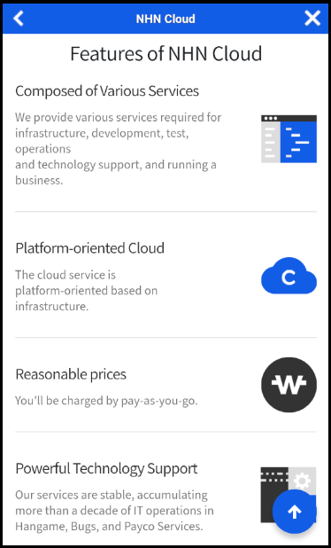

## WebView

Gamebase에서는 기본적인 웹뷰를 지원합니다.<br/>
웹뷰와 관련된 리소스(이미지 및 html, 기타 리소스)는 Gamebase.bundle에 포함돼 있습니다.

### Show WebView

웹뷰를 표시합니다.<br/>

##### Required 파라미터
* url: 파라미터로 전송되는 url은 유효한 값이어야 합니다.
* viewController: 웹뷰가 노출되는 ViewController입니다.

##### Optional 파라미터
* configuration: TCGBWebViewConfiguration으로 웹뷰의 레이아웃을 변경 할 수 있습니다.
* closeCompletion: 웹뷰가 종료될 때 사용자에게 콜백으로 알려 줍니다.
* schemeList: 사용자가 받고 싶은 커스텀 스킴 목록을 지정합니다.
* schemeEvent: schemeList로 지정한 커스텀 스킴을 포함하는 url을 콜백으로 알려 줍니다.


```objectivec
// Show Fullscreen Style WebView
- (void)showFullScreenWebView:(id)sender {
    NSString* urlString = @"https://www.toast.com/";
    void(^closeCompletion)(TCGBError *) = ^(TCGBError *error) {
        NSLog(@"WebView Close Event occured");
    };

    [TCGBWebView showWebViewWithURL:urlString viewController:self configuration:nil closeCompletion:closeCompletion schemeList:nil schemeEvent:nil];

}
```



#### Custom WebView
사용자 지정 웹뷰를 표시합니다.<br/>TCGBWebViewConfiguration으로 사용자 지정 웹뷰를 만들 수 있습니다.

```objectivec
- (void)showFixedOrientationWebView:(id)sender {
    NSString* urlString = @"https://www.toast.com/";
    TCGBWebViewConfiguration* config = [[TCGBWebViewConfiguration alloc] init];

    void(^closeCompletion)(TCGBError *) = ^(TCGBError *error) {
        NSLog(@"WebView Close Event occured");
    };

    [TCGBWebView showWebViewWithURL:urlString viewController:self configuration:config closeCompletion:closeCompletion schemeList:nil schemeEvent:nil];
}
```

```objectivec
// Configure Custom Style Configuration to All TCGBWebView Objects
- (void)configureWebViewStyle {
    // After this method is called, every webview(TCGBWebView) is shown with Landscape mode

    TCGBWebViewConfiguration *config = [[TCGBWebViewConfiguration alloc] init];
    [TCGBWebView sharedTCGBWebView].defaultWebConfiguration = config;
}
```


#### Custom Scheme 

Gamebase 웹뷰에서 로딩한 웹 페이지 내에 스킴으로 특정 기능을 사용하거나 웹 페이지 내용을 변경할 수 있습니다.

##### Predefined Custom Scheme

Gamebase에서 지정해 놓은 스키마입니다.<br/>

| scheme               | 용도                     |
| -------------------- | ---------------------- |
| gamebase://dismiss   | 웹뷰 닫기             |
| gamebase://goback    | 웹뷰 뒤로 가기          |
| gamebase://getuserid | 현재 로그인중인 있는 사용자의 아이디 표시 |
| gamebase://showwebview?link={URLEncodedURL} | link 파라메터의 URL 을 웹뷰로 열기.<br>URLEncodedURL: 웹뷰로 열 URL.<br>URL 디코딩 필요. |
| gamebase://openbrowser?link={URLEncodedURL} | link 파라메터의 URL을 외부 브라우저로 열기<br/>URLEncodedURL: 외부 브라우저로 열 URL<br/>URL 디코딩 필요 |


#### User Custom Scheme

Gamebase에 스킴 이름과 블록을 지정해 원하는 기능을 추가할 수 있습니다.


```objectivec

- (void)setCustomSchemes {
    NSString* urlString = @"https://www.toast.com/";
    
    void(^closeCompletion)(TCGBError *) = ^(TCGBError *error) {
        NSLog(@"WebView Close Event occured");
    };

    NSArray *schemeList = @[@"mygame://test", @"mygame://opensomebrowser"];

    void(^schemeEvent)(NSString *, TCGBError *error) = ^(NSString *fullUrl, TCGBError *error) {
        if ([TCGBGamebase isSuccessWithError:error] == YES) {
            if ([@"mygame://test" isEqualToString:fullUrl]) {
                NSLog(@"mygame://test scheme event occurred");
            } else if ([@"mygame://opensomebrowser" isEqualToString:fullUrl]) {
                NSLog(@"mygame://opensomebrowser scheme event occurred");
            }
        }
    };

    [TCGBWebView showWebViewWithURL:urlString viewController:self configuration:config closeCompletion:closeCompletion schemeList:schemeList schemeEvent:schemeEvent];
}
```


#### TCGBWebViewConfiguration

| Parameter                              | Values                                   | Description        |
| -------------------------------------- | ---------------------------------------- | ------------------ |
| navigationBarTitle                     | string                                   | 웹뷰의 제목        |
| contentMode                            | TCGBWebViewContentModeRecommended        | 현재 플랫폼 추천 브라우저(**default**)    |
|                                        | TCGBWebViewContentModeMobile             | 모바일 브라우저            |
|                                        | TCGBWebViewContentModeDesktop            | 데스크톱 브라우저          |
| navigationBarColor                     | UIColor                                  | 내비게이션 바 색상<br/>**default**: [UIColor colorWithRed: 0.07 green: 0.36 blue: 0.90 alpha: 1.00]   |
| navigationBarTitleColor                | UIColor                                  | 내비게이션 바 타이틀 색상<br/>**default**: UIColor.whiteColor   |
| navigationBarIconTintColor             | UIColor                                  | 내비게이션 바 아이콘 색상<br/>값을 설정하지 않으면 아이콘 원본 이미지가 표시됩니다.<br/>**default**: nil   |
| navigationBarHeight                    | CGFloat                                  | 내비게이션 바 높이<br/>**default**: 54 |
| isBackButtonVisible                    | YES or NO                                | 뒤로 가기 버튼 활성 또는 비활성<br/>**default**: YES |
| isNavigationBarVisible                 | YES or NO                                | 내비게이션 바 표시 또는 숨기기<br/>**default**: YES    |
| goBackImagePathForFullScreenNavigation | file name in Gamebase.bundle             | 뒤로 가기 버튼 이미지       |
| closeImagePathForFullScreenNavigation  | file name in Gamebase.bundle             | 닫기 버튼 이미지          |

> [TIP]
>
> iPadOS 13 이상에서 웹뷰는 기본적으로 데스크톱 모드입니다.
> contentMode=`TCGBWebViewContentModeMobile` 설정으로 모바일 모드로 변경할 수 있습니다.


### Close WebView
다음 API를 통하여, 보여지고 있는 웹뷰를 닫을 수 있습니다.

```objectivec
// Close the gamebase web view
- (void)closeWebView:(id)sender {
    [TCGBWebView closeWebView];
}
```
