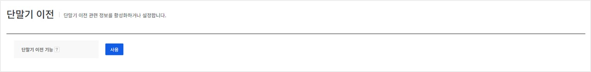
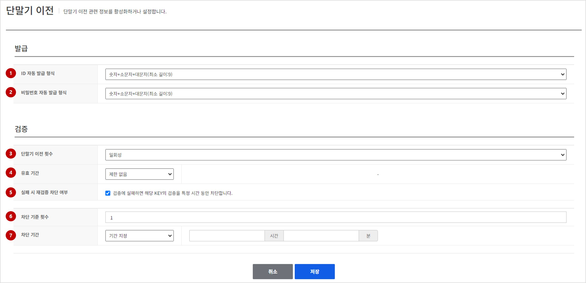
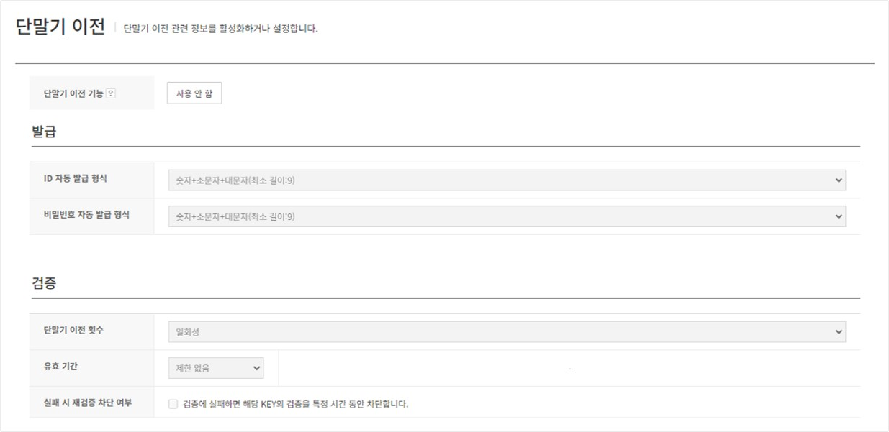

## Transfer account
게스트로 로그인한 게임 유저가 다른 아이디 제공자를 연동하지 않고 다른 단말기에서 이어서 게임을 할 수 있는 기능을 제공합니다.
사용자는 현재 게임 중인 단말기에서 이전을 위한 키를 발급받아 이전하려는 단말기에 키를 입력하는 것만으로 쉽게 게임 단말기를 변경할 수 있습니다.
**단말기 이전** 기능은 기본적으로 비활성화되어 있습니다. 사용하려면 **단말기 이전**에서 **사용하기**를 클릭합니다.

**사용하기** 버튼을 클릭한 후 단말기 이전에 필요한 정보를 입력합니다.

각 항목에 대한 설명은 아래와 같습니다.

### Properties

#### 발급
단말기 이전 발급 키의 형식을 설정합니다.
단말기 이전 키는 ID만 사용하거나 ID, 비밀번호 두 개의 키를 이용할 수 있습니다. ID, 비밀번호의 형식은 게임에서 원하는 소문자, 대문자, 숫자 조합으로 구성할 수 있습니다.

1. **ID 자동 발급 형식**: 단말기 이전 ID 발급 형식을 설정합니다. 설정 항목은 아래와 같습니다.
- **숫자(최소길이:12)**: 숫자로만 된 아이디를 발급합니다. 발급되는 ID의 최소 길이는 12자입니다.
- **숫자+소문자(최소길이:10)**: 숫자와 소문자의 조합으로만 구성된 ID를 발급합니다. 발급되는 ID의 최소 길이는 10자입니다.
- **숫자+대문자(최소길이:10)**: 숫자와 대문자의 조합으로만 구성된 ID를 발급합니다. 발급되는 ID의 최소 길이는 10자입니다.
- **숫자+소문자+대문자(최소길이:9)**: 숫자, 소문자, 대문자의 조합으로 구성된 ID를 발급합니다. 발급되는 ID의 최소 길이는 9자입니다.
- **소문자+대문자(최소길이:9)**: 소문자와 대문자의 조합으로만 구성된 ID를 발급합니다. 발급되는 ID의 최소 길이는 9자입니다.

2. **비밀번호 자동 발급 형식**: 단말기 이전 ID를 이용하여 로그인할 때 사용할 비밀번호 발급 형식을 설정합니다. 설정 항목은 아래와 같습니다.
- **비밀번호 사용 안함**: 비밀번호를 사용하지 않을 때 선택합니다. 이 항목을 선택하면 아래 검증 항목에서 아이디의 유효 시간만 설정할 수 있습니다.
- **숫자(최소길이:12)**: 숫자로만 구성된 비밀번호를 발급합니다. 발급되는 비밀번호의 최소 길이는 12자입니다.
- **숫자+소문자(최소길이:10)**: 숫자와 소문자의 조합으로만 구성된 비밀번호를 발급합니다. 발급되는 비밀번호의 최소 길이는 10자입니다.
- **숫자+대문자(최소길이:10)**: 숫자와 대문자의 조합으로만 구성된 ID를 발급합니다. 발급되는 비밀번호의 최소 길이는 10자입니다.
- **숫자+소문자+대문자(최소길이:9)**: 숫자, 소문자, 대문자의 조합으로 구성된 ID를 발급합니다. 발급되는 비밀번호의 최소 길이는 9자입니다.
- **소문자+대문자(최소길이:9)**: 소문자와 대문자의 조합으로만 구성된 ID를 발급합니다. 발급되는 비밀번호의 최소 길이는 9자입니다.

#### 검증
발급된 단말기 이전 키의 검증 조건을 설정합니다.
단말기 이전 키를 검증할 때 이전 횟수나 유효 기간, 실패 시 차단 등을 설정할 수 있습니다.
3. **단말기 이전 횟수**: 발급된 아이디의 단말기 이전이 가능한 횟수를 설정합니다. 무제한, 일회성 중 하나를 선택해야 합니다.
4. **유효 기간**: 발급된 계정의 유효 시간을 설정합니다. 발급된 단말기 이전 ID는 이 설정값의 영향을 받습니다. 무제한, 기간 설정 중 하나를 선택해야 합니다.
5. **실패 시 재검증 차단 여부**: 로그인을 시도하다 실패하면 특정 시간 동안 계정을 차단합니다. 선택하면 추가 설정 항목이 나타납니다.
6. **차단 기준 횟수**: **실패 시 재검증 차단 여부**를 선택하면 나타납니다. 입력한 횟수만큼 검증에 실패하면 계정이 차단됩니다. 1회 이상 설정해야 합니다.
7. **차단 기간**: 계정이 차단되고 얼마 후 다시 검증을 시도할 수 있는지 설정합니다. **영구 차단**, **기간 지정** 중 하나를 선택합니다. **기간 지정**을 선택하면 원하는 차단 시간과 분을 지정할 수 있습니다.

#### 초기 설정 완료 이후

최초 설정이 완료되면 게임 유저는 단말기 이전 기능의 비활성화만 가능하며 설정 변경이 필요할 경우 고객 센터에 문의하시기 바랍니다.
**사용 안함** 버튼을 클릭하여 기능을 비활성화할 수 있고 기존에 발급된 단말기 이전 키는 모두 삭제되기 때문에 활성화 이후에는 비활성화 여부를 신중하게 선택해야 합니다.
