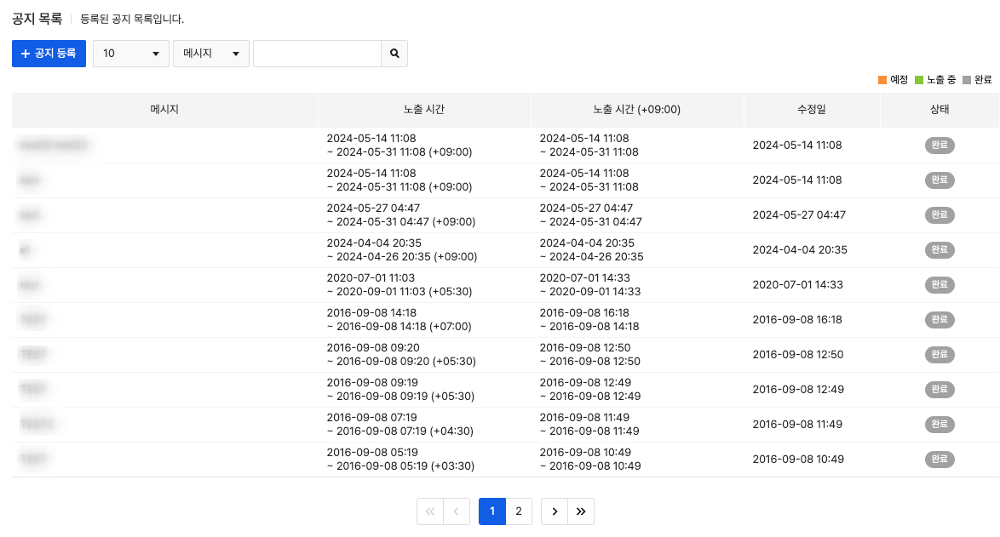
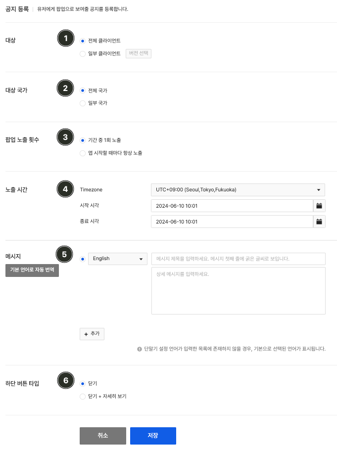

## Notice

앱 실행시 팝업 형태로 노출되는 공지를 제공합니다. 로그인 이전에 노출되는 팝업이므로 외부 인증 장애나 게임 서버 장애가 발생한 경우 등록하여 사용하면 됩니다.
등록된 공지리스트와 진행상태 등을 한눈에 확인 가능하며 공지메시지로 검색도 가능합니다.
공지 상태는 아래와 같이 세 가지로 구분되어 관리됩니다.

(1) 예정 : 공지가 노출될 예정
(2) 노출중 : 공지 노출중
(3) 완료 : 공지 노출시간 종료

### Register Notice

공지 메인화면에서 '등록'버튼을 클릭하면 공지를 등록하는 화면으로 이동합니다.

#### (1) 대상

공지를 노출할 대상을 선택합니다.

- 전체 게임 : 모든 클라이언트 버전에 점검이 필요한 경우 선택합니다.
- 일부 클라이언트 : 특정 클라이언트 버전에만 점검이 필요한 경우 선택합니다. '버전 선택'버튼을 클릭하면 클라이언트 메뉴에서 등록한 클라이언트 버전리스트가 출력됩니다.
   **일부 클라이언트 선택 화면 예시**
   클라이언트 상태 및 스토어별 전체 선택이 가능하며, 점검을 원하는 클라이언트 버전을 선택 후 확인 버튼을 누르면 됩니다.

#### (2) 대상 국가
공지를 노출할 국가를 선택합니다.

- 전체 국가 : 모든 사용자에게 노출
- 일부 국가 : 선택한 국가의 사용자에게만 공지 노출.
  추가하고자 하는 국가코드를 입력하면 자동으로 완성되어 입력됩니다. 입력하고자 하는 국가코드가 없는 경우 [고객 센터](https://toast.com/support/inquiry)로 연락 주시기 바랍니다.

> [참고]
>
> 국가 판단 기준
> 사용자의 **USIM 국가코드** 기준으로 판단하며 USIM이 없을 경우 **Device**에 설정되어 있는 국가를 기준으로 공지가 노출됩니다.

#### (3) 노출 횟수
공지가 사용자에게 노출되는 회수를 선택합니다.

- 기간 중 1회 노출 : 노출기간 중 1회 노출
- 앱 시작할때마다 항상 노출 : 노출기간 중 사용자가 앱을 실행할 때마다 공지를 노출

#### (4) 노출 시간
공지가 표시될 시간을 설정합니다.
Timezone의 경우 기본적으로 'UTC+09:00'이 선택되어 있으며, 서비스하는 국가의 시간대를 선택하여 점검을 등록하는 것도 가능합니다.

#### (5) 메시지
사용자에게 노출할 공지메시지를 입력합니다.
메시지는 다국어로 입력이 가능하며, 등록된 언어 중에 선택된 언어는 '기본언어'로 설정됩니다.
등록된 메시지 중에 매칭되는 언어가 없는 사용자에게는 '기본 언어'로 선택된 언어가 표시됩니다. 오른쪽의 **'+'**버튼을 클릭하면 언어 추가가 가능하며 원하는 언어가 없는 경우 [고객 센터](https://toast.com/support/inquiry)로 연락 주시면 새로운 언어 추가가 가능합니다.
'기본 언어로 자동 번역'버튼을 선택할 경우 기본언어로 입력된 내용을 기반으로 내용을 번역하여 각 항목에 설정된 언어에 맞게 내용이 입력됩니다.

#### (6) 하단 버튼 타입
공지 팝업 하단에 노출될 버튼의 타입을 지정합니다.
- 닫기: 닫기 버튼만 노출.
  '닫기'버튼 클릭하면 팝업을 닫고 게임을 진행합니다.

- 닫기+자세히 보기: '닫기'와 '자세히보기' 버튼을 노출.
  - 직접 입력: 사용자가 '자세히보기' 버튼을 클릭하면 Console에서 입력한 링크를 웹뷰로 오픈합니다.
  - 고객 센터 연결: Gamebase 제공 고객 센터 설정 시 사용자가 **자세히 보기**를 클릭하면 고객 센터를 웹뷰로 오픈합니다.

#### 긴급 공지 팝업 예시
**닫기**를 선택할 경우 왼쪽 이미지와 같이 '닫기(CLOSE)' 버튼만 노출되며, **닫기+자세히 보기**를 선택할 경우 오른쪽 이미지와 같이 '닫기(CLOSE)'와 '자세히 보기(SHOW DETAIL)' 버튼이 노출됩니다. 

### Modify Notice

등록한 공지의 상세내용을 확인하고 수정, 삭제가 가능합니다.
기본적으로 입력 항목은 등록 화면과 동일하며, 공지를 잘못 등록한 경우 삭제 버튼을 클릭해 삭제할 수 있습니다.
유사한 내용으로 점검을 다시 등록하고자 하는 경우 복사 기능을 통하여 공지를 쉽게 등록할 수 있습니다.
