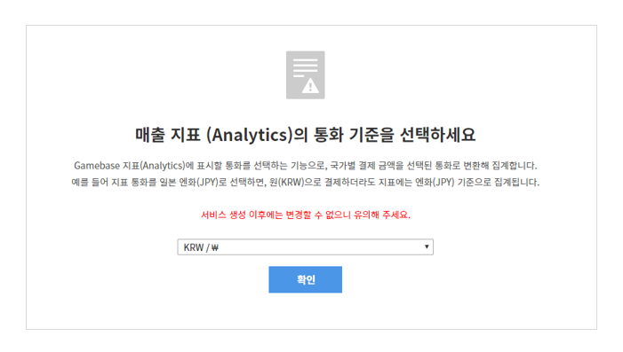

## IAP 메뉴 이용에 앞서

IAP 메뉴를 이용하려면 결제 지표를 위한 통화를 먼저 선택해 주셔야 합니다.
최초 한번만 설정 가능하며 Analytics 매출지표에는 설정된 통화코드로 지표가 노출됩니다.
한번 선택한 통화코드는 변경할 수 없으니 신중히 선택해 주세요.

## Game > Gamebase > 콘솔 사용 가이드 > 결제

인앱 결제와 관련된 정보를 등록하고 내역을 조회할 수 있습니다.
Gamebase에서는 NHN Cloud IAP(In-App Purchase, 인앱 결제) 서비스를 사용합니다.
