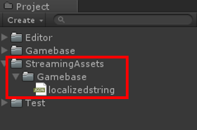

### Display Language

점검 팝업 창과 같이 Gamebase가 표시하는 언어는 단말기에 설정된 언어로 표시됩니다.

그런데 게임에서 표시하는 언어를 단말기에 설정된 언어가 아닌, 별도의 옵션으로 언어를 변경할 수 있는 게임이 있습니다.
예를 들어, 단말기에 설정된 언어는 영어 이지만 게임 표시 언어를 일본어로 변경한 경우, Gamebase 에서 표시하는 언어도 일본어로 변경하고 싶지만 Gamebase 가 표시하는 언어는 단말기에 설정된 언어인 영어로 표시됩니다.

이와 같이 `단말기에 설정된 언어가 아닌, 다른 언어로 Gamebase 메시지를 표시하고 싶은` 애플리케이션을 위해 Gamebase 는 `Display Language` 라는 기능을 제공합니다.

Gamebase 는 Display Language 로 설정한 언어로 Gamebase 메시지를 표시합니다.
Display Language 에 입력하는 언어 코드는 반드시 아래의 표(**Gamebase에서 지원하는 언어코드의 종류**)에 지정된 코드만을 사용할 수 있습니다.

> <font color="red">[주의]</font><br/>
>
> * Display Language 는 단말기 설정 언어와 무관하게 Gamebase 의 표시 언어를 변경하고 싶은 경우에만 사용하시기 바랍니다.
> * Display Language Code 는 ISO-639 형태의 값으로, 대소문자를 구분합니다.
> 'EN'이나 'zh-cn'과 같이 설정하면 문제가 발생할 수 있습니다.
> * 만일 Display Language Code 로 입력한 값이 아래의 표(**Gamebase에서 지원하는 언어코드의 종류**)에 존재하지 않는다면, Display Langauge Code 는 자동으로 기본값인 영어(en)로 지정됩니다.

> [참고]
>
> * Gamebase의 클라이언트 메시지는 영어(en), 한글(ko), 일본어(ja)만 포함하고 있으므로 아래의 표에 존재하는 언어 코드라 할지라도 영어(en), 한글(ko), 일본어(ja) 이외의 언어를 지정하면 기본값인 영어(en)로 자동 설정됩니다.
> * Gamebase의 클라이언트에 포함되어 있지 않은 언어셋은 직접 추가할 수 있습니다.
> **신규 언어셋 추가** 항목을 참조하시기 바랍니다.

#### Gamebase에서 지원하는 언어코드의 종류

| Code | Name |
| --- | --- |
| de | German |
| en |English  |
| es | Spanish |
| fi | Finnish |
| fr | French |
| id | Indonesian |
| it | Italian |
| ja | Japanese |
| ko | Korean |
| pt | Portuguese |
| ru | Russian |
| th | Thai |
| vi | Vietnamese |
| ms | Malay |
| zh-CN | Chinese-Simplified |
| zh-TW | Chinese-Traditional |

해당 언어 코드는 `GamebaseDisplayLanguageCode` 클래스에 정의되어 있습니다.

```cs
namespace Toast.Gamebase
{
    public class GamebaseDisplayLanguageCode
    {
        public const string German = "de";
        public const string English = "en";
        public const string Spanish = "es";
        public const string Finnish = "fi";
        public const string French = "fr";
        public const string Indonesian = "id";
        public const string Italian = "it";
        public const string Japanese = "ja";
        public const string Korean = "ko";
        public const string Portuguese = "pt";
        public const string Russian = "ru";
        public const string Thai = "th";
        public const string Vietnamese = "vi";
        public const string Malay = "ms";
        public const string Chinese_Simplified = "zh-CN";
        public const string Chinese_Traditional = "zh-TW";
    }
}
```

#### Gamebase 초기화 시 Display Language 설정

Gamebase 초기화 시 Display Language를 설정할 수 있습니다.

**API**

Supported Platforms
<span style="color:#1D76DB; font-size: 10pt">■</span> UNITY_IOS
<span style="color:#0E8A16; font-size: 10pt">■</span> UNITY_ANDROID
<span style="color:#F9D0C4; font-size: 10pt">■</span> UNITY_STANDALONE
<span style="color:#5319E7; font-size: 10pt">■</span> UNITY_WEBGL
<span style="color:#B60205; font-size: 10pt">■</span> UNITY_EDITOR

```cs
static void Initialize(GamebaseRequest.GamebaseConfiguration configuration, GamebaseCallback.GamebaseDelegate<GamebaseResponse.Launching.LaunchingInfo> callback)
```

**Example**

``` cs
public void InitializeWithConfiguration()
{
    var configuration = new GamebaseRequest.GamebaseConfiguration();
    ...
    configuration.displayLanguageCode = displayLanguage;
    ...
    
    Gamebase.Initialize(configuration, (launchingInfo, error) =>
    {
        if (Gamebase.IsSuccess(error))
        {
            Debug.Log("Gamebase initialization succeeded.");
            string displayLanguage = Gamebase.GetDisplayLanguageCode();
        }
        else
        {
            Debug.Log(string.Format("Gamebase initialization failed. error is {0}", error));
        }
    });
}
```

#### Set Display Language

Gamebase 초기화 시 입력된 Display Language를 변경할 수 있습니다.

**API**

Supported Platforms
<span style="color:#1D76DB; font-size: 10pt">■</span> UNITY_IOS
<span style="color:#0E8A16; font-size: 10pt">■</span> UNITY_ANDROID
<span style="color:#F9D0C4; font-size: 10pt">■</span> UNITY_STANDALONE
<span style="color:#5319E7; font-size: 10pt">■</span> UNITY_WEBGL
<span style="color:#B60205; font-size: 10pt">■</span> UNITY_EDITOR

```cs
static void SetDisplayLanguageCode(string languageCode)
```

**Example**

``` cs
public void SetDisplayLanguageCode()
{
    Gamebase.SetDisplayLanguageCode(GamebaseDisplayLanguageCode.English);
}
```

#### Get Display Language

현재 적용된 Display Language를 조회할 수 있습니다.

**API**

Supported Platforms
<span style="color:#1D76DB; font-size: 10pt">■</span> UNITY_IOS
<span style="color:#0E8A16; font-size: 10pt">■</span> UNITY_ANDROID
<span style="color:#F9D0C4; font-size: 10pt">■</span> UNITY_STANDALONE
<span style="color:#5319E7; font-size: 10pt">■</span> UNITY_WEBGL
<span style="color:#B60205; font-size: 10pt">■</span> UNITY_EDITOR

```cs
static string GetDisplayLanguageCode()
```

**Example**

``` cs
public void GetDisplayLanguageCode()
{
    string displayLanguage = Gamebase.GetDisplayLanguageCode();
}
```

#### 신규 언어셋 추가

UnityEditor 및 Unity Standalone, WebGL 플랫폼 서비스 시, Gamebase에서 제공하는 기본 언어(ko, en) 외 다른 언어를 사용하려면 Assets > StreamingAssets > Gamebase에 있는 localizedstring.json 파일에 값을 추가해야 합니다.



localizedstring.json에 정의되어 있는 형식은 아래와 같습니다.

```json
{
  "en": {
    "common_ok_button": "OK",
    "common_cancel_button": "Cancel",
    ...
    "launching_service_closed_title": "Service Closed"
  },
  "ko": {
    "common_ok_button": "확인",
    "common_cancel_button": "취소",
    ...
    "launching_service_closed_title": "서비스 종료"
  },
  "ja": {
    "common_ok_button": "確認",
    "common_cancel_button": "キャンセル",
    ...
    "launching_service_closed_title": "サービス終了"
  },
}
```

다른 언어셋을 추가해야 할 경우에는 localizedstring.json 파일에 `"${언어 코드}":{"key":"value"}` 형태로 값을 추가하면 됩니다.

```json
{
  "en": {
    "common_ok_button": "OK",
    "common_cancel_button": "Cancel",
    ...
    "launching_service_closed_title": "Service Closed"
  },
  "ko": {
    "common_ok_button": "확인",
    "common_cancel_button": "취소",
    ...
    "launching_service_closed_title": "서비스 종료"
  },
  "ja": {
    "common_ok_button": "確認",
    "common_cancel_button": "キャンセル",
    ...
    "launching_service_closed_title": "サービス終了"
  },
  "${언어코드}": {
      "common_ok_button": "...",
      ...
  }
}
```

Unity Android, iOS 플랫폼에서의 신규 언어셋 추가 방법은 아래 가이드를 참고하십시오.

* [Android 신규 언어셋 추가](../../aos-etc.md#display-language)
* [iOS 신규 언어셋 추가](../../ios-etc.md#display-language)

#### Display Language 우선순위

초기화 및 SetDisplayLanguageCode API를 통해 Display Language를 설정할 경우, 최종 적용되는 Display Language는 입력한 값과 다르게 적용될 수 있습니다.

1. 입력된 languageCode가 localizedstring.json 파일에 정의되어 있는지 확인합니다.
2. Gamebase 초기화 시, 단말기에 설정된 언어코드가 localizedstring.json 파일에 정의되어 있는지 확인합니다.(이 값은 초기화 이후, 단말기에 설정된 언어를 변경하더라도 유지됩니다.)
3. Display Language의 기본값인 `en`이 자동으로 설정됩니다.
