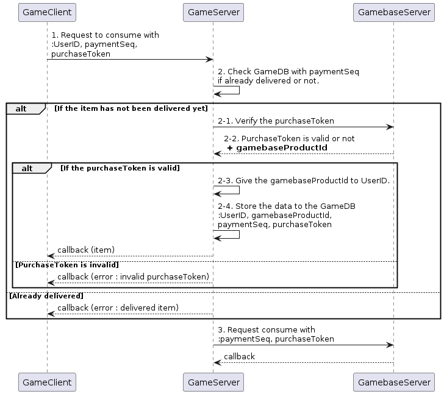
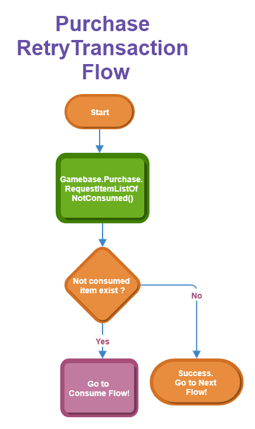

## Game > Gamebase > Unity SDK 사용 가이드 > 결제

여기에서는 Unity에서 인앱 결제 기능을 사용하기 위해 필요한 설정 방법을 알아보겠습니다.
Gamebase는 하나의 통합된 결제 API를 제공해 게임에서 손쉽게 많은 스토어의 인앱 결제를 연동할 수 있도록 돕습니다.

> <font color="red">[주의]</font><br/>
>
> 외부 패키지에서 결제 관련 처리가 있는 경우, Gamebase 결제 기능이 정상적으로 동작하지 않을 수 있습니다.

### Settings

Android나 iOS에서 인앱 결제 기능을 설정하는 방법은 다음 문서를 참고하시기 바랍니다.<br/>

* [Android Purchase Settings](aos-purchase#settings)<br/>
* [iOS Purchase Settings](ios-purchase#settings)

### Purchase Flow

아이템 구매는 크게 결제 Flow 와 Consume Flow, 재처리 Flow 로 나누어 볼 수 있습니다.
결제 Flow는 다음과 같은 순서로 구현하시기 바랍니다.


1. 이전 결제가 정상적으로 종료되지 못한 경우 재처리가 동작하지 않으면 결제가 실패합니다. 그러므로 결제 전에 **RequestItemListOfNotConsumed**를 호출하여 재처리를 동작시켜 미지급된 아이템이 있으면 Consume Flow 를 진행합니다.
2. 게임 클라이언트에서는 Gamebase SDK의 **RequestPurchase**를 호출하여 결제를 시도합니다.
3. 결제가 성공하였다면 **RequestItemListOfNotConsumed**를 호출하여 미소비 결제 내역을 확인한 후 지급할 아이템이 존재한다면 Consume Flow 를 진행합니다.

### Consume Flow

미소비 결제 내역 목록에 값이 있으면 다음과 같은 순서로 Consume Flow 를 진행하시기 바랍니다.

> <font color="red">[주의]</font><br/>
>
> 아이템이 중복 지급되는 일이 발생하지 않도록, 게임 서버에서 반드시 중복 지급 여부를 체크하시기 바랍니다.
>



1. 게임 클라이언트가 게임 서버에 결제 아이템에 대한 consume(소비)을 요청합니다.
    * UserID, paymentSeq, purchaseToken을 전달합니다.
2. 게임 서버는 게임 DB에 이미 동일한 paymentSeq로 아이템을 지급한 이력이 있는지 확인합니다.
    * 2-1. 아직 아이템을 지급하지 않았다면 Gamebase 서버의 Payment Transaction API를 호출하여 purchaseToken이 유효한지, 응답 필드의 paymentSeq와 일치하는지 검증합니다.
        * [Game > Gamebase > API 가이드 > Purchase(IAP) > Get Payment Transaction](../../api-guide.md#get-payment-transaction)
        * purchaseToken이 서버 API 가이드 문서의 **accessToken**에 해당합니다.
    * 2-2. gamebaseProductId는 서버의 Payment Transaction API의 응답 필드에서 확인할 수 있습니다.
        * 클라이언트의 미소비 결제 내역 목록에도 gamebaseProductId가 존재하지만, 재처리 시에는 해당 값이 없을 수도 있으므로 서버의 Payment Transaction API로부터 획득한 gamebaseProductId 값을 사용하시기 바랍니다.
    * 2-3. Payment Transaction API 호출이 성공하여 purchaseToken이 정상이라고 확인되면 UserID에 gamebaseProductId에 해당하는 아이템을 지급합니다.
    * 2-4. 아이템 지급 후 게임 DB에 UserID, gamebaseProductId, paymentSeq, purchaseToken을 저장하여 중복 지급 방지 또는 재지급을 할 수 있도록 합니다.
3. 아이템 지급 여부와 무관하게 게임 서버는 더 이상 미소비 내역이 리턴되지 않도록 Gamebase 서버의 consume(소비) API를 호출하여 아이템 지급을 완료합니다.
    * [Game > Gamebase > API 가이드 > Purchase(IAP) > Consume](../../api-guide.md#consume)

### Retry Transaction Flow



* 스토어 결제에는 성공했으나 오류가 발생해 정상 종료되지 못하는 경우가 있습니다.
* **RequestItemListOfNotConsumed**를 호출하여 재처리를 동작시켜 미지급된 아이템이 있으면 Consume Flow 를 진행하세요.
* 재처리는 다음과 같은 시점에 호출할 것을 권장합니다.
    * 로그인 완료 후.
    * 결제 전.
    * 게임 내 상점(또는 로비) 진입시.
    * 유저 프로필 또는 우편함 확인시.

### Purchase Items

구매하고자 하는 아이템의 gamebaseProductId를 사용하여 구매를 요청합니다.<br/>
gamebaseProductId는 일반적으로 스토어에 등록한 아이템의 id와 동일하지만, Gamebase 콘솔에서 변경할 수도 있습니다.<br/>

게임 유저가 구매를 취소하는 경우 **PURCHASE_USER_CANCELED** 오류가 반환됩니다.
취소 처리를 해 주시기 바랍니다.

느린 결제나 부모 동의와 같이 결제 완료를 기다려야 하는 상황이 발생하는 경우에는 **GamebaseError.PURCHASE_PENDING** 오류가 반환됩니다.
이후에 결제가 정상적으로 완료되는 경우, GamebaseEventHandler에서 결제 완료 이벤트를 수신할 수 있습니다.
[Game > Gamebase > Unity SDK 사용 가이드 > ETC > Gamebase Event Handler](../../unity-etc.md#purchase-updated)

**API**

Supported Platforms
<span style="color:#1D76DB; font-size: 10pt">■</span> UNITY_IOS
<span style="color:#0E8A16; font-size: 10pt">■</span> UNITY_ANDROID

```cs
static void RequestPurchase(string gamebaseProductId, GamebaseCallback.GamebaseDelegate<GamebaseResponse.Purchase.PurchasableReceipt> callback)
```

**Example**
```cs
public void RequestPurchase(string gamebaseProductId)
{
    Gamebase.Purchase.RequestPurchase(gamebaseProductId, (purchasableReceipt, error) =>
    {
        if (Gamebase.IsSuccess(error))
        {
            Debug.Log("Purchase succeeded.");
        }
        else
        {
        	if (error.code == (int)GamebaseErrorCode.PURCHASE_USER_CANCELED)
            {
                Debug.Log("User canceled purchase.");
            }
            else
            {
            	Debug.Log(string.Format("Purchase failed. error is {0}", error));
            }
        }
    });
}
```

**VO**
```cs
public class PurchasableReceipt
{
    /// <summary>
    /// 구매한 아이템의 상품 ID입니다.
    /// </summary>
    public string gamebaseProductId;

    /// <summary>
    /// itemSeq 로 상품을 구매하는 Legacy API용 식별자입니다.
    /// </summary>
    public long itemSeq;

    /// <summary>
    /// 구매한 상품의 가격입니다.
    /// </summary>
    public float price;

    /// <summary>
    /// 통화 코드입니다.
    /// </summary>
    public string currency;

    /// <summary>
    /// 결제 식별자입니다.
    /// purchaseToken과 함께 'Consume' 서버 API를 호출하는 데 사용하는 중요한 정보입니다.
    ///    
    /// 주의: Consume API 는 게임 서버에서 호출하세요!
    /// <para/><see href="https://docs.toast.com/en/Game/Gamebase/en/api-guide/#purchase-iap">Consume API</see>
    /// </summary>
    public string paymentSeq;

    /// <summary>
    /// 결제 식별자입니다.
    /// paymentSeq 와 함께 'Consume' 서버 API를 호출하는데 사용하는 중요한 정보입니다.
    /// Consume API 에서는 'accessToken' 라는 이름의 파라메터로 전달해야 합니다.
    ///    
    /// 주의: Consume API 는 게임 서버에서 호출하세요!
    /// <para/><see href="https://docs.toast.com/en/Game/Gamebase/en/api-guide/#purchase-iap">Consume API</see>
    /// </summary>
    public string purchaseToken;

    /// <summary>
    /// Google, Apple 과 같이 스토어 콘솔에 등록된 상품 ID입니다.
    /// </summary>
    public string marketItemId;

    /// <summary>
    /// 상품 타입으로, 다음 값들이 올 수 있습니다.
    /// * UNKNOWN: 인식 불가능한 타입. Gamebase SDK 를 업데이트 하거나 Gamebase 고객 센터로 문의하세요.
    /// * CONSUMABLE: 소비성 상품.
    /// * AUTO_RENEWABLE: 구독형 상품.
    /// * CONSUMABLE_AUTO_RENEWABLE: 구독형 상품을 구매한 유저에게 정기적으로 소비가 가능한 상품을 지급하고자 하는 경우 사용되는 '소비가 가능한 구독 상품'.
    /// <para/><see cref="GamebasePurchase.ProductType"/>
    /// </summary>
    public string productType;

    /// <summary>
    /// 상품을 구매했던 User ID.
    /// 상품을 구매하지 않은 User ID 로 로그인 한다면 구매한 아이템을 획득할 수 없습니다.
    /// </summary>
    public string userId;

    /// <summary>
    /// 스토어의 결제 식별자입니다.
    /// </summary>
    public string paymentId;

    /// <summary>
    /// 구독 상품은 갱신될 때마다 paymentId가 변경됩니다.
    /// 이 필드는 맨 처음 구독 상품을 결제 했을때의 paymentId 를 알려줍니다.
    /// 스토어에 따라, 결제 서버 상태에 따라 값이 존재하지 않을 수 있으므로
    /// 항상 유효한 값을 보장하지는 않습니다.
    /// </summary>
    public string originalPaymentId;

    /// <summary>
    /// 상품을 구매했던 시각입니다.(epoch time)
    /// </summary>
    public long purchaseTime;

    /// <summary>
    /// 구독이 종료되는 시각입니다.(epoch time)
    /// </summary>
    public long expiryTime;


    /// <summary>
    /// 결제한 스토어 코드입니다.
    /// GamebaseStoreCode 클래스에서 스토어 코드 목록을 확인할 수 있습니다.
    /// </summary>
    public string storeCode;

    /// <summary>
    /// Gamebase.Purchase.requestPurchase API 호출 시 payload 로 전달했던 값입니다.
    /// 스토어 서버 상태에 따라 정보가 유실되는 경우가 있으므로 사용을 권장하지 않습니다.
    /// </summary>
    public string payload;

    /// <summary>
    /// 프로모션 결제 여부
    /// - (Android) Gamebase 결제 서버에서 일시적으로 검증 로직을 끄는 경우에는 false로만 출력되므로 항상 유효한 값이 보장되지 않습니다.
    /// </summary>
    public bool isPromotion;
    
    /// <summary>
    /// 테스트 결제 여부
    /// - (Android) Gamebase 결제 서버에서 일시적으로 검증 로직을 끄는 경우에는 false로만 출력되므로 항상 유효한 값이 보장되지 않습니다.
    /// </summary>
    public bool isTestPurchase;
}
```

### List Purchasable Items

아이템 목록을 조회하려면 다음 API를 호출합니다. 
콜백으로 반환되는 목록 안에는 각 아이템들에 대한 정보가 담겨 있습니다.

**API**

Supported Platforms
<span style="color:#1D76DB; font-size: 10pt">■</span> UNITY_IOS
<span style="color:#0E8A16; font-size: 10pt">■</span> UNITY_ANDROID

```cs
static void RequestItemListPurchasable(GamebaseCallback.GamebaseDelegate<List<GamebaseResponse.Purchase.PurchasableItem>> callback)
```

**Example**
```cs
public void RequestItemListPurchasable()
{
    Gamebase.Purchase.RequestItemListPurchasable((purchasableItemList, error) =>
    {
        if (Gamebase.IsSuccess(error))
        {
            Debug.Log("Get list succeeded.");
        }
        else
        {
            Debug.Log(string.Format("Get list failed. error is {0}", error));
        }
    });
}
```

**VO**
```cs
public class PurchasableItem
{
    /// <summary>
    /// Gamebase 콘솔에 등록된 상품 ID입니다.
    /// Gamebase.Purchase.requestPurchase API로 상품을 구매할 때 사용됩니다.
    /// </summary>
    public string gamebaseProductId;

    /// <summary>
    /// itemSeq 로 상품을 구매하는 Legacy API용 식별자입니다.
    /// </summary>
    public long itemSeq;

    /// <summary>
    /// 상품의 가격입니다.
    /// </summary>
    public float price;

    /// <summary>
    /// 통화 코드입니다.
    /// </summary>
    public string currency;

    /// <summary>
    /// Gamebase 콘솔에 등록된 상품 이름입니다.
    /// </summary>
    public string itemName;

    /// <summary>
    /// Google, Apple 과 같이 스토어 콘솔에 등록된 상품 ID입니다.
    /// </summary>
    public string marketItemId;

    /// <summary>
    /// 상품 타입으로, 다음 값들이 올 수 있습니다.
    /// * UNKNOWN: 인식 불가능한 타입. Gamebase SDK 를 업데이트 하거나 Gamebase 고객 센터로 문의하세요.
    /// * CONSUMABLE: 소비성 상품.
    /// * AUTORENEWABLE: 구독형 상품.
    /// * CONSUMABLE_AUTO_RENEWABLE: 구독형 상품을 구매한 유저에게 정기적으로 소비가 가능한 상품을 지급하고자 하는 경우 사용되는 '소비가 가능한 구독 상품'.
    /// <para/><see cref="GamebasePurchase.ProductType"/>
    /// </summary>
    public string productType;

    /// <summary>
    /// 통화 기호가 포함된 현지화 된 가격 정보입니다.
    /// </summary>
    public string localizedPrice;

    /// <summary>
    /// 스토어 콘솔에 등록된 현지화된 상품 이름입니다.
    /// </summary>
    public string localizedTitle;

    /// <summary>
    /// 스토어 콘솔에 등록된 현지화된 상품 설명입니다.
    /// </summary>
    public string localizedDescription;

    /// <summary>
    /// Gamebase 콘솔에서 해당 상품의 '사용 여부'를 나타냅니다.
    /// </summary>
    public bool isActive;
}
```

### List Non-Consumed Items

아이템을 구매했지만, 정상적으로 아이템이 소비(배송, 지급)되지 않은 미소비 결제 내역을 요청합니다.
미결제 내역이 있는 경우에는 게임 서버(아이템 서버)에 요청하여, 아이템을 배송(지급)하도록 처리해야 합니다.
정상적으로 결제가 완료되지 못한 경우 재처리의 역할도 하므로 다음 상황에서 호출해 주세요.
* 게임 유저에게 지급되지 못한 아이템이 남아 있는지 확인
    * 로그인 완료 후
    * 게임 내 상점(또는 로비) 진입시
    * 유저 프로필 또는 우편함 확인시
* 재처리가 필요한 아이템이 있는지 확인
    * 결제 전
    * 결제 실패 후

**GamebaseRequest.Purchase.PurchasableConfiguration**

| API                             | Mandatory(M) / Optional(O) | Description                                                                    |
| ------------------------------- | -------------------------- | ------------------------------------------------------------------------------ |
| allStores                       | O                          | 동일한 UserID로 다른 스토어에서 구매한 미소비 내역도 반환합니다.<br/>기본값은 **false**입니다. |

**API**

Supported Platforms
<span style="color:#1D76DB; font-size: 10pt">■</span> UNITY_IOS
<span style="color:#0E8A16; font-size: 10pt">■</span> UNITY_ANDROID

```cs
static void RequestItemListOfNotConsumed(GamebaseRequest.Purchase.PurchasableConfiguration configuration, GamebaseCallback.GamebaseDelegate<List<GamebaseResponse.Purchase.PurchasableReceipt>> callback)
```

**Example**
```cs
public void RequestItemListOfNotConsumedSample(bool allStores)
{
    var configuration = new GamebaseRequest.Purchase.PurchasableConfiguration
    {
        allStores = allStores
    };

    Gamebase.Purchase.RequestItemListOfNotConsumed(configuration, (purchasableReceiptList, error) =>
    {
        if (Gamebase.IsSuccess(error))
        {
            Debug.Log("Get list succeeded.");

            // Should Deal With This non-consumed Items.
            // Send this item list to the game(item) server for consuming item.
        }
        else
        {
            Debug.Log(string.Format("RequestItemListOfNotConsumed failed. error is {0}", error));
        }
    });
}
```
